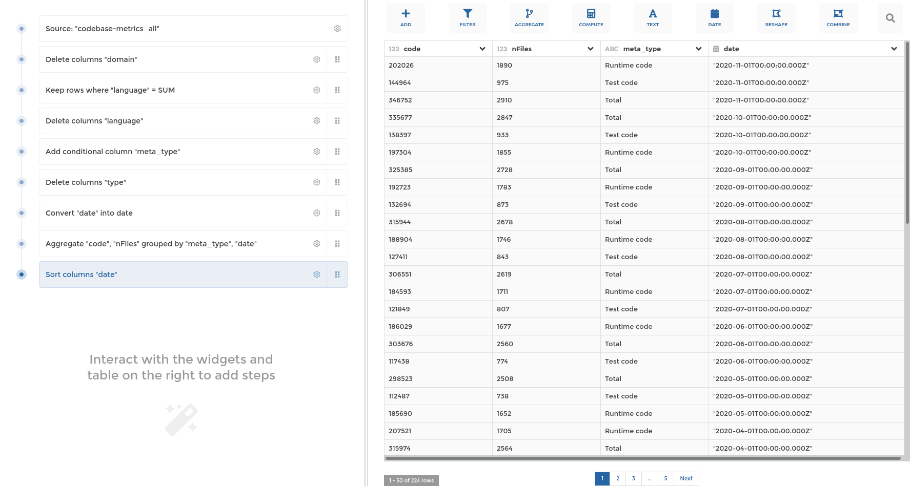

#  Weaverbird



Weaverbird is [Toucan Toco](https://toucantoco.com)'s data pipelines toolkit, it contains :

- a pipeline **Data Model**, currently supporting more than 40 transformation steps
- a friendly **User Interface** for building those pipelines without writing any code,
  made with TypeScript, VueJS & VueX
- a set of **BackEnds** to use those pipelines :
  - the MongoDB Translator that generate Mongo Queries, written in TypeScript
  - the Pandas Executor that compute the result using Pandas dataframes, written in Python
  - the Snowflake SQL translator, written in Python

For in depth user & technical documentation, have a look at weaverbird.toucantoco.com  
or at the documentation's source files in the `docs` directory.

Last but not least, you can **play with Weaverbird on our [online playground](https://weaverbird-playground-ujaf.onrender.com/)**!

## Badges

### UI
[](https://www.npmjs.com/package/weaverbird)

[](https://sonarcloud.io/dashboard?id=ToucanToco_weaverbird)
[](https://sonarcloud.io/dashboard?id=ToucanToco_weaverbird)
[](https://sonarcloud.io/dashboard?id=ToucanToco_weaverbird)
<!-- [](https://codecov.io/gh/ToucanToco/weaverbird/) -->

### Server
[](https://pypi.org/project/weaverbird/)


## Project setup

```bash
yarn install
```

**Requirement: node > v11**

### Compiles target library

```bash
yarn build-bundle
```

This will generate an importable JS `VisualQueryBuilder` library in the `dist` directory.

**Important note**: While we do our best to embrace [semantic versioning](https://semver.org/),
we do not guarantee full backward compatibility until version 1.0.0 is realeased.

### Run your tests

The basic command to run all tests is:

```bash
yarn test:unit
```

You can also use a watcher so that tests rerun automatically
on a change:

```bash
yarn test:unit --watchAll
```

To run a single test file:

```bash
yarn test:unit path/to/yourfile.ts
```

Finally, you can deactivate typescript checks to run tests quicker:

```bash
yarn test:quick
```

This can be useful to accelerate your development cycle temporarily when
developing a new feature or fixing a bug. Under the hood, this will use the
`babel-jest` transformer on typescript files instead of `ts-jest`.

### Lints and fixes files

```bash
yarn lint
```

### Build the API documentation

```bash
yarn build-doc
```

This will run [typedoc](https://typedoc.org/) on the `src/` directory and
generate the corresponding documentation in the `dist/docs` directory.

### Build and run the documentation website

> The web documentation is powered by [Jekyll](https://jekyllrb.com).

> You can find all the sources into the `docs` folder.

> To build and locally launch the documentation you need Ruby and gem before starting, then:

```bash
# install ruby
sudo apt install ruby ruby-dev

# install bundler
gem install bundler

# run jekyll and a local server with dependencies :
cd docs
bundle install
bundle exec jekyll serve
```

#### Enrich it!

> put your `.md` file into the `docs` folder. You can add a folder as well to better organization

> into your `.md` file don't forget to declare this at the beginning of the file :

```
---
title: your title doc name
permalink: /docs/your-page-doc-name/
---
```

> to finish to get your page into the doc navigation you have to add it in `_data/docs.yml``

example :
```
- title: Technical documentation
  docs:
  - steps
  - stepforms
  - your-page-doc-name
```

### Run the storybook

> Storybook uses the bundled lib, so all showcased components must be in the public API.

```bash
yarn storybook
```

This will run [storybook](https://storybook.js.org/), displaying the stories
(use cases) of UI components.

Stories are defined in the `stories/` directory.

### Customize configuration

See [Configuration Reference](https://cli.vuejs.org/config/).

## Publication

This library is published on npm under the name `weaverbird` automatically each time a release is created in GitHub.

### Create a release (frontend)

- Define new version using [semantic versioning](https://semver.org/)

- Create a new local branch `release/X.Y.Z` from master

  ex: `release/0.20.0`

- Update the `version` property in `package.json` and in `sonar-project.properties`

- Check differences between last release and current and fill `CHANGELOG.md` with updates
  - Delete the ```##changes``` title at start of the `CHANGELOG.md` if provided
  - Add the date and version at start of `CHANGELOG.md` following this convention

    ```
    [X.Y.Z] - YYYY-MM-DD
    ```
    ex: `[0.20.0] - 2020-08-03`

  - Add link to the `CHANGELOG.md` from this version to the previous one at the end of the `CHANGELOG.md`

    ```
    [X.Y.Z]: https://github.com/ToucanToco/weaverbird/compare/voldX.oldY.oldZ...vX.Y.Z
    ```

    ex: [0.20.0]: https://github.com/ToucanToco/weaverbird/compare/v0.19.2...v0.20.0

- Commit changes with version number

  ex: `v0.20.0`

- Push branch

- Create a pull request into master from your branch

- When pull request is merged, [create a release](https://github.com/ToucanToco/weaverbird/releases) with the version number in tag version and title (no description needed)

  ex: `v0.20.0`

- Hit the release "publish release" button (this will automatically create a tag and trigger the [package publication](https://github.com/ToucanToco/weaverbird/actions?query=workflow%3A%22npm+publish%22) )

### Create a release (backend)

- Create a new local branch `chore/bump-server-version-x-x-x`

- Edit `server/pyproject.toml` & increment the version in `[tool.poetry]` section

- Push branch

- Create a pull request into master from your branch

- Once the PR is approved & merged in master publish the release in Pypi with `make build` & `make upload`

## Usage as library

### Without any module bundler

```html
<!-- Import styles -->
<link rel="stylesheet" href="weaverbird/dist/weaverbird.umd.min.js" />

<!-- Import scripts -->
<script src="vue.js"></script>
<script src="weaverbird/dist/weaverbird.umd.min.js"></script>
```

### With an ES module bundler (typically webpack or rollup)

```js
import { Pipeline } from 'weaverbird';
```

> By default, the CommonJS module is imported. If you prefer the ES module
> version, import `dist/weaverbird.esm.js`.

### Styles

If your module bundler can also import CSS (e.g. via `styles-loader`):

```js
import 'weaverbird/dist/weaverbird.css';
```

If you prefer to use Sass, you may import directly the scss:

```scss
@import '~weaverbird/src/styles/main';
```

> This example makes use of the `~` syntax from webpack's [sass-loader](https://github.com/webpack-contrib/sass-loader)
> to resolve the imported modules.

## API

### Modules

See the documentation generated in `dist/docs` directory

### Styles

TODO: document here sass variables that can be overriden

## Playground

The `/playground` directory hosts a demo application with a small server that
showcases how to integrate the exported components and API. To run it, use the provided `Dockerfile`:

```bash
docker build -t weaverbird-playground .
docker run -p 5000:5000 --rm -d weaverbird-playground
```

which is basically a shortcut for the following steps:

```bash
# install front-end dependencies
yarn
# build the front-end bundle
yarn build-bundle
# note: use --watch when developing

cd server
# install the backend dependencies
pip install -e ".[playground]"
# run the server
QUART_APP=playground QUART_ENV=development quart run
# note: in the dockerfile, a production-ready webserver is used instead of a development one
```

Once the server is started, you should be able to open the
`http://localhost:5000` in your favorite browser and enjoy!

### Mongo back-end

The default back-end for the playground is a small server passing queries to MongoDB.
Connect the playground to a running MongoDB instance with the environment variables:
- MONGODB_CONNECTION_STRING (default to localhost:27017)
- MONGODB_DATABASE_NAME (default to 'data')

### Pandas back-end

An alternative back-end for the playground is a small server running in python, executing pipelines with pandas.
Add `?backend=pandas` to the URL to see it in action.

#### Use your own data files

CSVs from `playground/datastore` are available to use in the playground with pandas.
You can override this folder when running the container using by adding a volume parameter:
`-v /path/to/your/folder/with/csv:/weaverbird/playground/datastore`.
