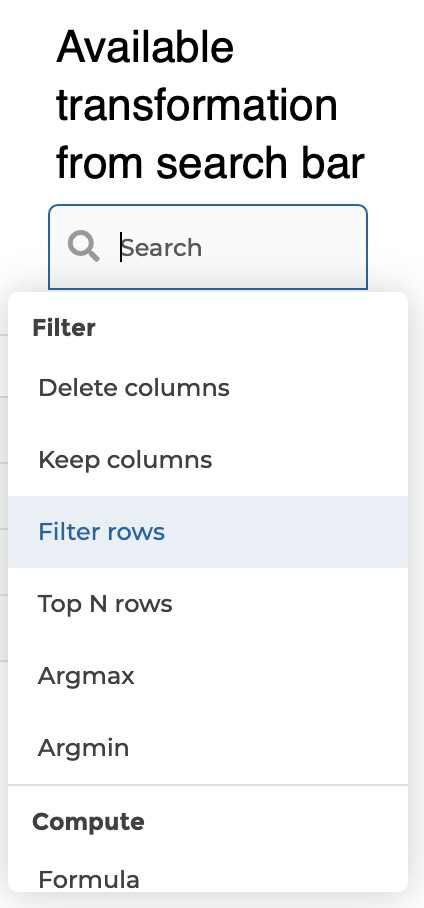
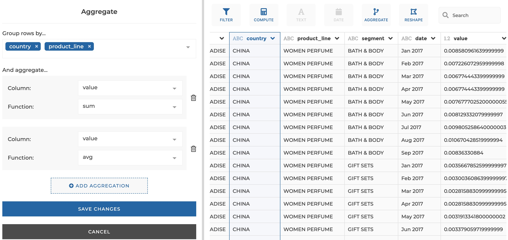
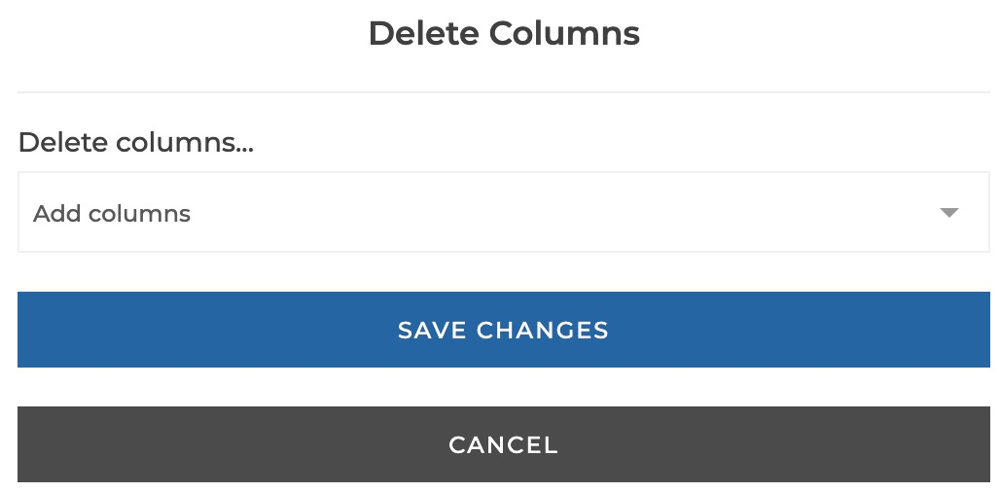
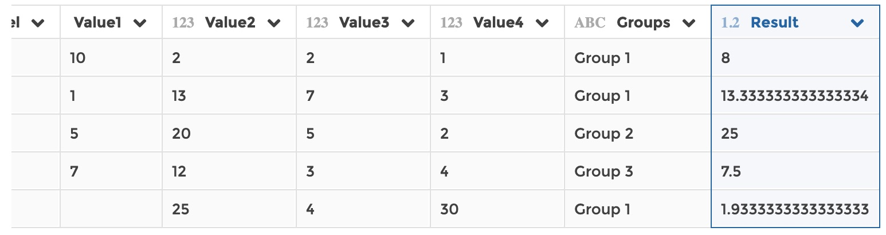
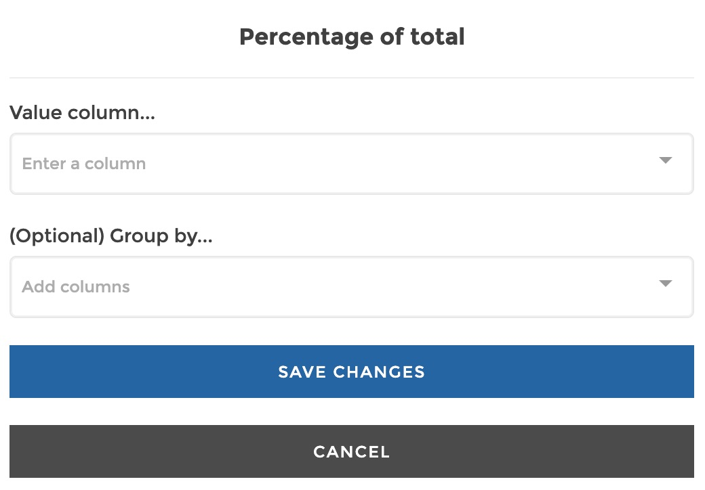
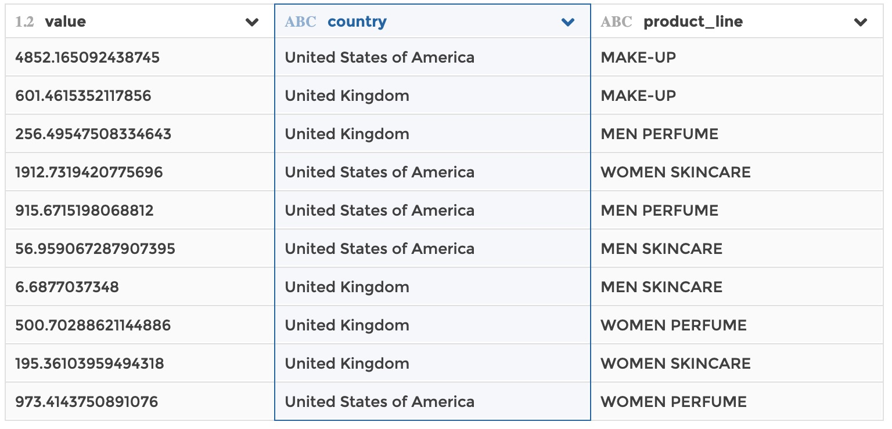
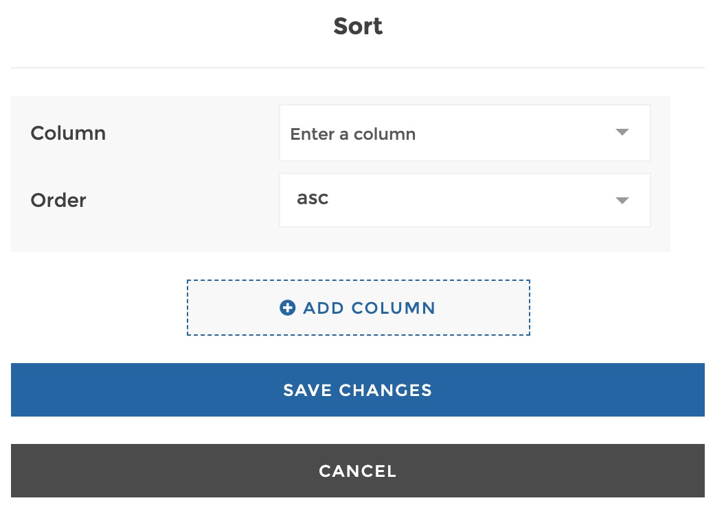
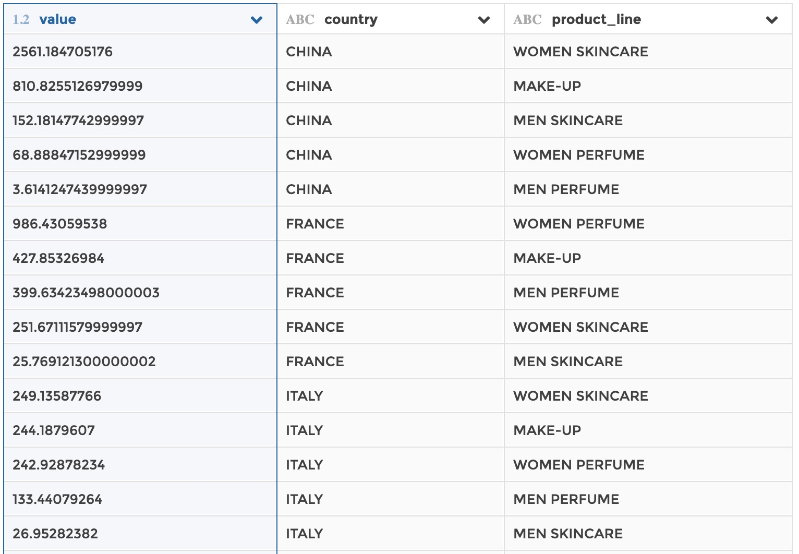
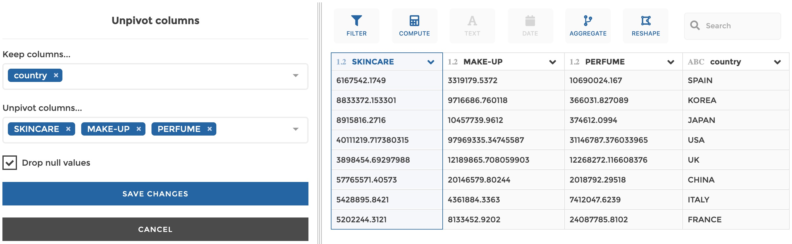

# User interface

## General principles

The Visual Query Builder interface breaks down into 2 panels:

- the **transformation pipeline on the left**: this is where you can see the
  ordered series of transformation steps that are applied to your data. When you
  need to configure a given step, the left panel switches to the **step edition
  form**

- the **data table on the right**: this is where you can click on your data to apply
  transformations. The right panel also includes **widgets** above the table.
  Transformations are available from the columns headers, from the widgets or
  can be found via the **search bar**.

 
 

&nbsp;&nbsp;&nbsp;&nbsp;&nbsp;&nbsp;&nbsp;&nbsp;&nbsp;&nbsp;&nbsp;&nbsp;&nbsp;
&nbsp;&nbsp;&nbsp;&nbsp;&nbsp;&nbsp;&nbsp;&nbsp;&nbsp;&nbsp;&nbsp;&nbsp;&nbsp;

&nbsp;&nbsp;&nbsp;&nbsp;&nbsp;&nbsp;&nbsp;&nbsp;&nbsp;&nbsp;&nbsp;&nbsp;&nbsp;
&nbsp;&nbsp;&nbsp;&nbsp;&nbsp;&nbsp;&nbsp;&nbsp;&nbsp;&nbsp;&nbsp;&nbsp;&nbsp;

 
 

Everytime you interact with the table or widgets to transform data, the
corresponding step is logged in the transformation pipeline. Any step can be
edited or deleted.
If a step in the middle of the pipeline gets edited or deleted, the following
steps remain unchanged.

If you click on any step of the pipeline, the data table on the right will
update to show you the result of the transformations until this step. Following
steps get greyed to show that they are temporarily disabled and not executed.
In that sense, **the pipeline acts as a history that you can navigate into. It
can be very helpful when debugging!**

You can **insert a step in the middle of the pipeline**. The general rule is
that a step is added immediately after the selected step in the pipeline. So if
you want to insert a step in the midlle of the pipeline, just select the step
after which you need to insert your new step, and apply your transformation.

## Transformation steps

### Aggregate

You can use this step to perform aggregations on one or several columns.
Equivalent to a `GROUP BY` clause in SQL, or to the `$group` operator in Mongo
aggregation pipeline.

#### Where to find this step?

- Widget `Aggregate`
- Search bar

#### Options reference

- `Group rows by...`: you can select one or several columns that will be used
  to constitute unique groups (equivalent to the columns that you would specify
  after the `GROUP BY` clause in SQL or in the `_id` field of a `$group` in
  Mongo aggregation pipeline)

- `And aggregate...`: in this section of the form you can specify one or more
  columns to aggregate, with the corresponding aggregation function to be
  applied (equivalent to `SUM(MY_COLUMN)` for example in SQL, or to
  `my_column: { $sum: { $my_column } }` in Mongo). You can add a columnn to
  aggregate by clicking on the button `Add aggregation`.

  - `Column`: the columnn to be aggregated

  - `Function` the aggregation function to be applied (sum, average, count, min
    or max )

#### Example

This configuration results in:

### Argmax

You can use this step to get row(s) matching the maximum value in a given
column. You can optionally specify to apply the step by group, i.e. get max
row(s) by group.

#### Where to find this step?

- Widget `Filter`
- Search bar

#### Options reference

- `Search max value in...`: the column the maximum value will be searched in

- `Group by...` (optional): you can optionally select one or several columns
  that will be used to constitute unique groups (equivalent to the columns that
  you would specify after the `GROUP BY` clause in SQL or in the `_id` field of
  a `$group` in Mongo aggregation pipeline). Then the step will return max
  row(s) for every group)

#### Example

This configuration results in:

### Argmin

You can use this step to get row(s) matching the minimum value in a given
column. You can optionally specify to apply the step by group, i.e. get min
row(s) by group.

#### Where to find this step?

- Widget `Filter`
- Search bar

#### Options reference

- `Search min value in...`: the column the minimum value will be searched in

- `Group by...` (optional): you can optionally select one or several columns
  that will be used to constitute unique groups (equivalent to the columns that
  you would specify after the `GROUP BY` clause in SQL or in the `_id` field of
  a `$group` in Mongo aggregation pipeline). Then the step will return min
  row(s) for every group)

#### Example

This configuration results in:

### Delete column(s)

You can use this step to delete column(s).

#### Where to find this step?

- Column header menu
- Widget `Filter`
- Search bar

#### Options reference

If a column is selected, clicking on `delete` will delete this column. If no
column is selected or if you edit an existing `delete` step, it will open the
form where you can select one or several columns to delete.

- `Delete columns...`: the column(s) to delete

### Duplicate column

You can use this step to dupicate a column.

#### Where to find this step?

- Column header menu
- Search bar

#### Options reference

- `Duplicate column...`: the column to duplicate

- `New column name...`: the name of the column copy (it will raise an error if
  you try to set a name that is already used for another column)

#### Example

This configuration results in:

### Fill null values

You can use this step to fill null values in a column with a value of your
choice.

#### Where to find this step?

- Column header menu
- Search bar

#### Options reference

- `Replace null values in...`: the target column

- `With...`: the value that will replace null values

#### Example

This configuration results in:

### Filter rows

You can use this step to filter rows based on one or several conditions. At the
moment, we only support `and` as logical link between conditions.

#### Where to find this step?

- Column header menu
- Widget `Filter`
- Search bar

#### Options reference

- `Values in ...`: the target column

- `Must...`: a comparison operator (equal, not equal etc.)

- Then you can enter a value to be compared to. For `be one of` and `not be one of`
  comparison operators, you can enter several values

- `Add condition`: use this button if you need to add a new condition line. The
  retained rows will be those match every condition (logical `and`)

#### Example

This configuration results in:

### Formula

You can use this step to create a column as a formula based on other columns.
A column can be referenced by its name without quotes or any other escaping
character.

**Warning: we do not support column names including whitespaces at the moment.
So please apply a rename step beforehand if needed.** (For example rename
`my column` into `my_column`)

You can also specify a text escaped by quotes. It will then write the specified
text in every row of the new column.

#### Where to find this step?

- Widget `Compute`
- Search bar

#### Options reference

- `Formula`: the formula, which can be an algebraic formula composed of numbers,
  maths operators and columns; it can also be a text (escaped by quotes) to
  uniformly fill the column with that text.

- `New column`: the name of the new column to be created with the formula
  result.

#### Example 1: algebric formula

This configuration results in:

#### Example 2: filling a column with a text

This configuration results in:

### Keep column(s)

You can use this step to keep a column(s), meaning that it will delete every
other columns.
Useful when you have a lot of columns and that you only need to use a few of
them. Then it is quicker and easier to express what you want to keep rather than
what you want to exclude.

#### Where to find this step?

- Widget `Filter`
- Search bar

#### Options reference

You can specify one or several column(s) to keep.

- `Keep columns...`: the column(s) to keep

### Percentage

Compute the percentage of total as the share of every row in the column total.
The computation can be performed by group if specified (i.e. the percentage of
total will be computed inside every group, as the share of every row in the
total of its group).

#### Where to find this step?

- Widget `Compute`
- Search bar

#### Options reference

- `Value column...`: The column that will be used for the computation

- `Group by...` (optional): if you want the computation to be segmented by
  group, you can select one or several columns that will be used to constitute
  unique groups (equivalent to the columns that you would specify after the
  `GROUP BY` clause in SQL or in the `_id` field of a `$group` in Mongo
  aggregation pipeline)

#### Example

This configuration results in:

### Pivot column

You can use this step if you need to transform rows into columns. It is the
reverse operation of an `unpivot` step.

Pivoting a column into several columns means that every unique label found in
that column becomes a column header. The column gets pivoted "around" fixed
columns that you can specify. You also need to specify a value column where
values will be found to fill pivoted columns. If aggregation needs to be
performed, you can choose the aggregation function (`sum` by default).

Equivalent to the `PIVOT` clause in SQL.

#### Where to find this step?

- Widget `Reshape`
- Search bar

#### Options reference

- `Keep columns...`: the columns to remain fixed, around which the pivot will
  occur

- `Pivot column...`: the column to be pivoted

- `Use values in...`: the columns where values are found to fill the pivoted
  columns

- `Aggregate values using...`: the aggregation function to be used when
  aggregation has to be performed

#### Example

This configuration results in:

### Rename column

You can use this step to rename a column.

#### Where to find this step?

- Column header menu
- Search bar

#### Options reference

- `Old name`: the original column name

- `New name`: the new column name

#### Example

This configuration results in:

### Replace values

You can use this step to replace values in a column.

#### Where to find this step?

- Column header menu
- Search bar

#### Options reference

- `Search in column...`: the column in which to search for values to replace

- `Values to replace`: in this section of the form you can specify one or more
  values to replace, with the corresponding new value that you expect.

#### Example

This configuration results in:

### Sort values

You can use this step to sort values based on one or several columns.

#### Where to find this step?

- Column header menu
- Search bar

#### Options reference

- `Column...`: the column where values will be sorted

- `Order`: whether you want the values in this column to be sorted in ascending
  (`asc`) or descending order (`desc`).

You can add columns to apply a combined sort, by clicking on "Add column". The
order of columns matters, i.e. first the first column will be sorted, then and
without changing the order of the first column, the second column will be
sorted etc. Please see the example below for illustration.

You can specify if you want to rank rows based on one or several columns.

#### Example

This configuration results in:

First the column country is sorted by ascending order, and then values are
sorted by descending order.

### To lowercase

You can use this step to convert a text column to lowercase.

Hint: you can use this step on a numeric column to convert that numeric
column to a text column (i.e. it converts numbers into a numeric text).

#### Where to find this step?

- Column header menu
- Widget `Text`
- Search bar

#### Options reference

- `Convert column...`: the column to be converted into lowercase

#### Example

This configuration results in:

### To uppercase

You can use this step to convert a text column to uppercase.

Hint: you can use this step on a numeric column to convert that numeric
column to a text column (i.e. it converts numbers into a numeric text).

#### Where to find this step?

- Column header menu
- Widget `Text`
- Search bar

#### Options reference

- `Convert column...`: the column to be converted into uppercase

#### Example

This configuration results in:

### Top N rows

Use this step if you need to get the top N rows of your data based on value
column to be ranked. The top can be performed by group if specified (i.e. if you
want a top 3 by group, it will return the top 3 rows for every group - see the
example below for illustration).

Similar to a `SELECT TOP` clause in SQL.

#### Where to find this step?

- Widget `Filter`
- Search bar

#### Options reference

- `Get top...`: specify the numer of top rows to retain

- `Sort column...`: the ranking will be based on this column (so its values must
  be sortable)

- `Sort order...`: wether the you want the above column to e sorted on ascending
  (`asc`) or descending (`desc`) order

- `Group by...` (optional): if you want to return a top by group, you can
  select one or several columns that will be used to constitute unique groups
  (equivalent to the columns that you would specify after the `GROUP BY` clause
  in SQL or in the `_id` field of a `$group` in Mongo aggregation pipeline)

#### Example

This configuration results in:

We get the top 3 brands by country.

### Unpivot column

You can use this step if you need to transform columns into rows. It is the
reverse operation of a `pivot` step.

Unpivoting columns into a unique column means that every unpivoted column header
will be used as a label in the output unique column. The columns get unpivoted
"around" fixed columns that you can specify. The step creates two new columns:
a `variable` column where you can find the labels corresponding to the unpivoted
columns headers, and a `value` column where you can find the value for every
label.

Equivalent to the `UNPIVOT` clause in SQL.

#### Where to find this step?

- Widget `Reshape`
- Search bar

#### Options reference

- `Keep columns...`: the columns to remain fixed, around which the unpivot will
  occur

- `Unpivot columns...`: the columns to be unpivoted

- `Drop null values...`: whether to drop rows if their value is null in the
  output `value` column

#### Example

This configuration results in:

