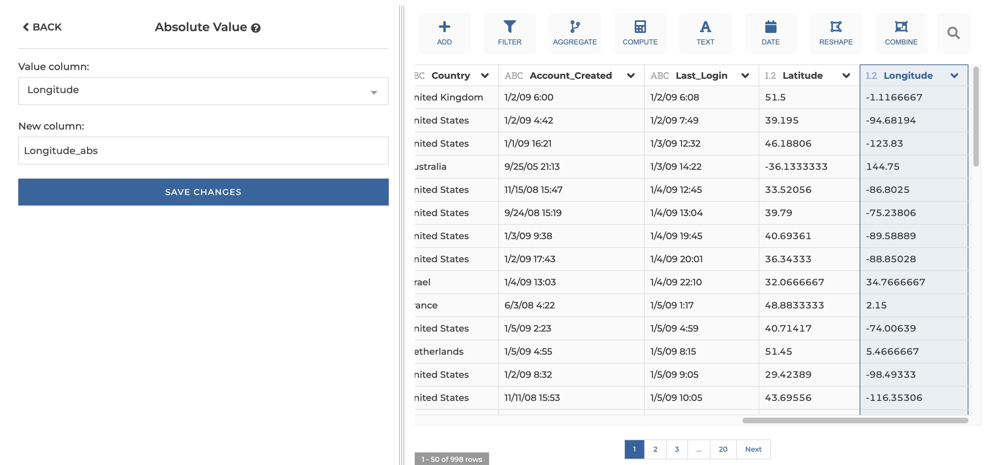
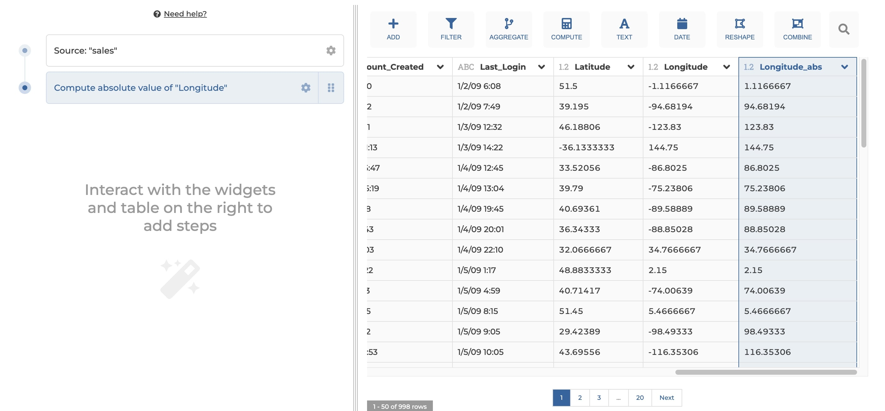

### Compute absolute value

Create a new column that corresponds to the absolute value of the input column.

**This step is supported by the following backends:**

- Mongo 5.0
- Mongo 4.2
- Mongo 4.0
- Mongo 3.6
- Pandas (python)

#### Where to find this step?

- Widget `Compute`
- Search bar

#### Options reference

- `Input column`: the name of the input column

- `New column name`: the name of the new column to be created

#### Example:

This configuration results in:

