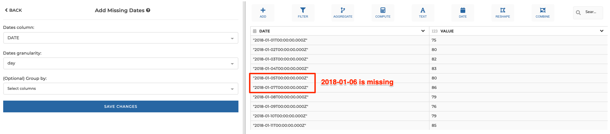
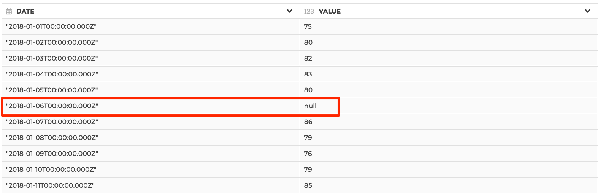
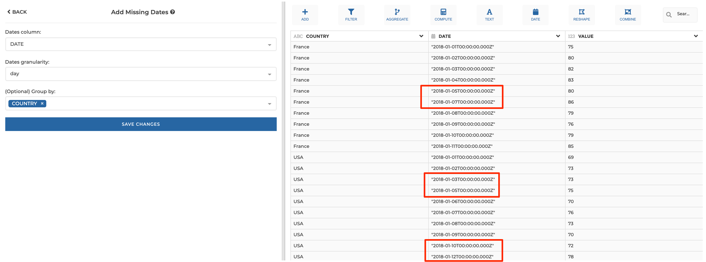
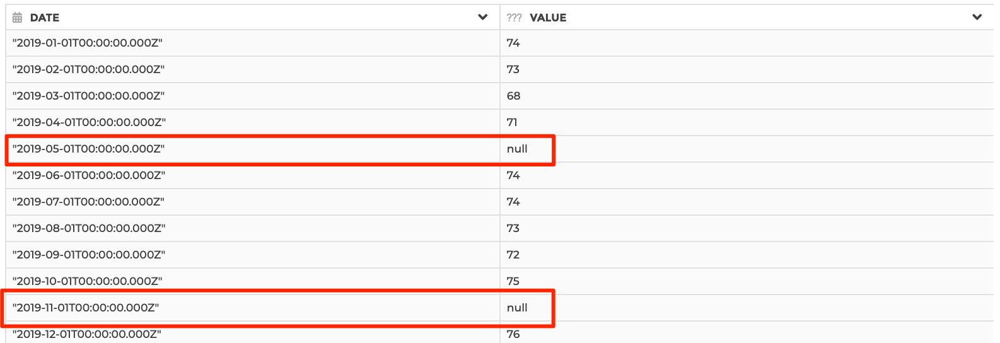

### Add Missing Dates

Add missing dates as new rows in a dates column. Exhaustive dates will range
between the minimum and maximum date found in the dataset (or in each group if
a group by logic is applied - see thereafter).

Added rows will be set to null in columns not referenced in the step configuration.
You can use a "Fill null values" step afterwards if you need to fill those nulls.

You should make sure to use a group by logic if you want to add missing dates in
independent groups of rows (e.g. you may need to add missing rows for every
country found in a "COUNTRY" column). And you should ensure that every date is
unique in every group of rows at the specified granularity, else you may get
inconsistent results. You can specify "group by" columns in the `Group by`
parameter as shown below. Please see example 2 below for illustration.

**This step is supported by the following backends:**

- Mongo 4.2
- Mongo 4.0
- Mongo 3.6

#### Where to find this step?

- Widget `Dates`
- Search bar

#### Options reference

- `Dates column`: the date column (must be of type date) with missing dates

- `Dates granularity`: the granularity of the date column (day, month or year)

* `(Optional) Group by`: (optional). Use this option if you need to perform add
  missing dates in independent groups of rows. You should make sure that every
  date is unique inside each and every group. See example 2 below for illustration.

#### Example 1: day granularity without group by logic

This configuration results in:

#### Example 2: day granularity with group by logic

Note that "2018-01-12" will not be considered as a missing row for "France" rows,
because the latest date found for this group of rows is "2018-01-11" (even though
"2018-01-12" is the latest date found for "USA" rows).

#### Example 3: month granularity

This configuration will results in:

