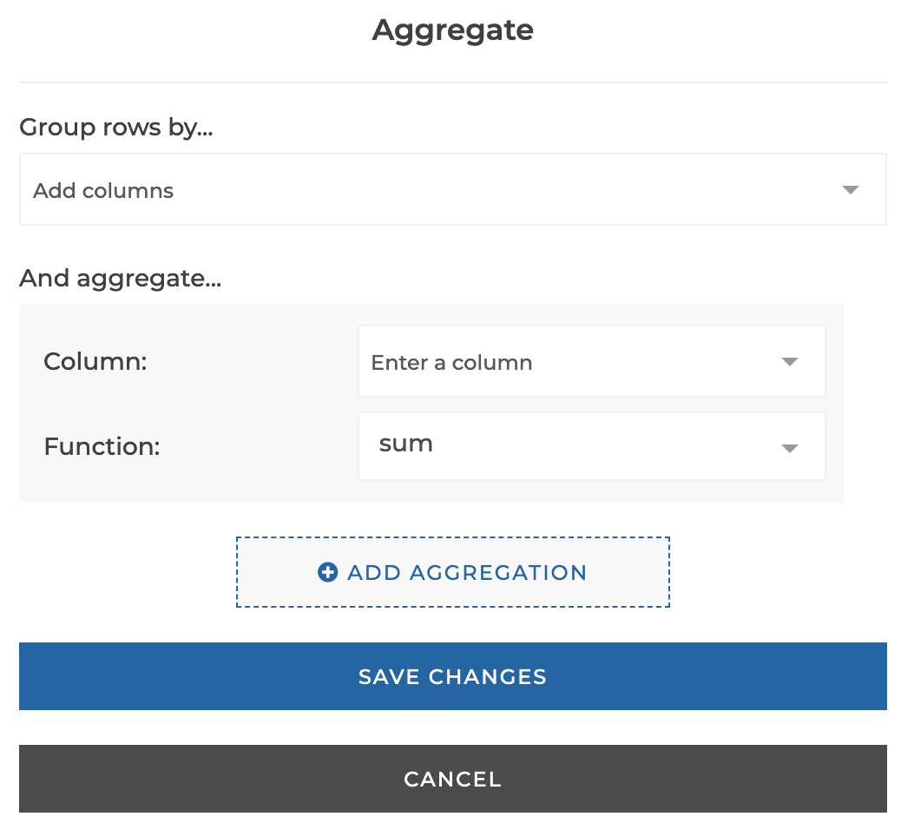
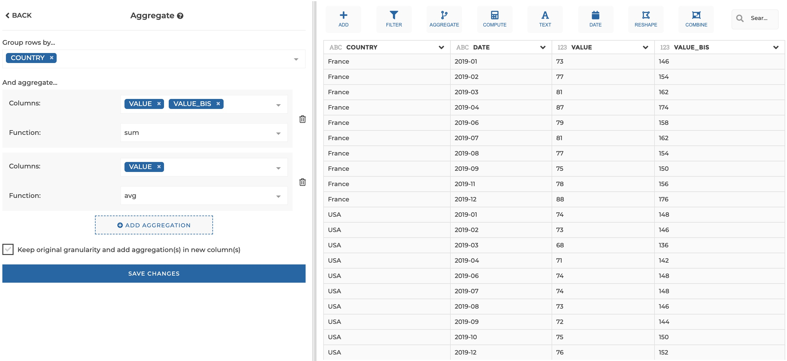
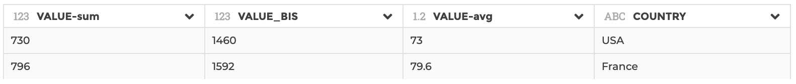
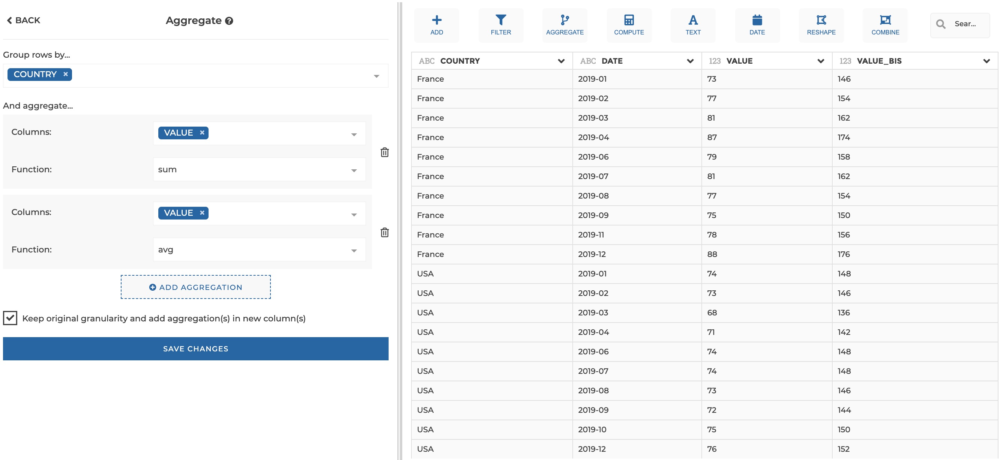
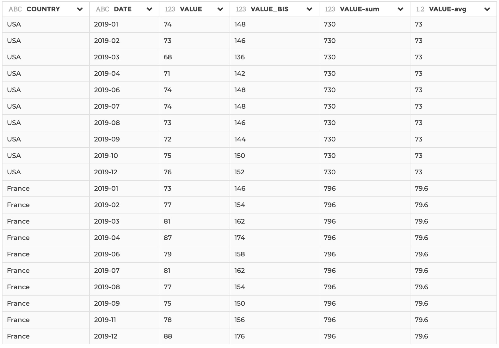

### Aggregate

You can use this step to perform aggregations on one or several columns.
Equivalent to a `GROUP BY` clause in SQL, or to the `$group` operator in Mongo
aggregation pipeline.

**This step is supported by the following backends:**

- Mongo 4.2
- Mongo 4.0
- Mongo 3.6
- Pandas (python)

#### Where to find this step?

- Widget `Aggregate`
- Search bar

#### Options reference

- `Group rows by...`: you can select one or several columns that will be used
  to constitute unique groups (equivalent to the columns that you would specify
  after the `GROUP BY` clause in SQL or in the `_id` field of a `$group` in
  Mongo aggregation pipeline)

- `And aggregate...`: in this section of the form you can specify one or more
  columns to aggregate, with the corresponding aggregation function to be
  applied (equivalent to `SUM(MY_COLUMN)` for example in SQL, or to
  `my_column: { $sum: { $my_column } }` in Mongo). You can add columns to
  aggregate by clicking on the button `Add aggregation`.

  - `Columns`: the columns to be aggregated (you can apply the same aggregation
    function to several columns at once)

  - `Function` the aggregation function to be applied (sum, average, count,
    count distinct, min, max, first or last)

- `Keep original granularity and add aggregation(s) in new column(s)`: whether
  to keep the original granularity, in that case computed aggregations will be
  added in new columns

#### Example 1: do not keep original granularity

This configuration results in:

#### Example 2: keep original granularity

This configuration results in:

