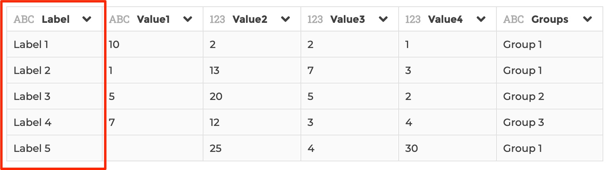
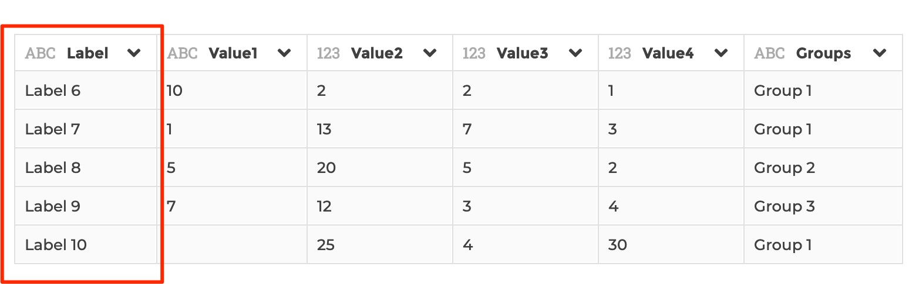
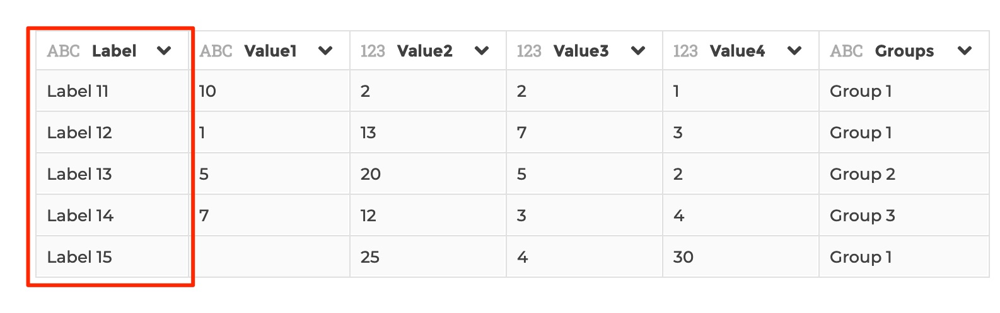
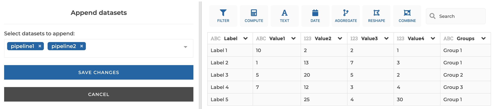
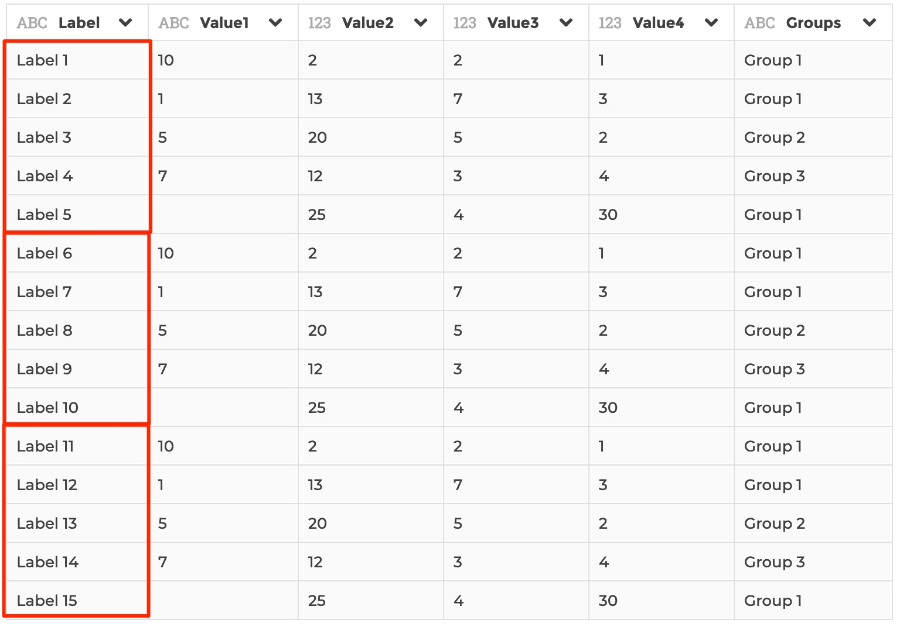

### Append

You can use this step to append on or several registered datasets to the
current dataset

**This step is supported by the following backends:**

- Mongo 4.2
- Mongo 4.0
- Mongo 3.6
- Pandas (python)

#### Where to find this step?

- Widget `Combine`
- Search bar

#### Options reference

- `Select datasets to append`: the name of the datasets you want to append to
  the current dataset

#### Example

Say your daatset being currently edited looks like this:

And say you have 2 datasets, `dataset1` and `dataset2` stored in your application:

- `dataset1`:

  

- `dataset2`:

  

Then if you you apply the following configuration on the current dataset...

...It will result in:

