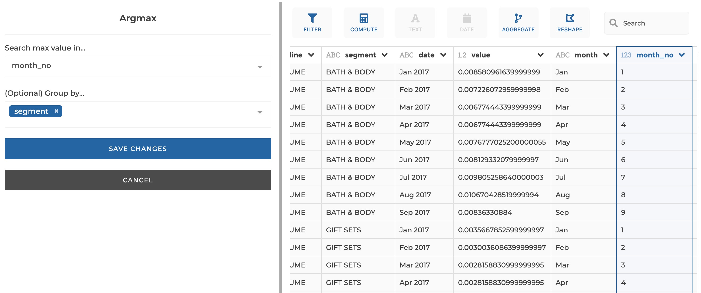
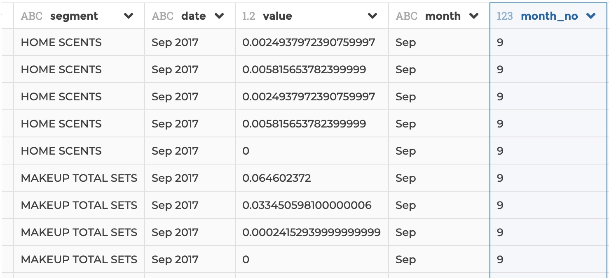

### Argmax

You can use this step to get row(s) matching the maximum value in a given
column. You can optionally specify to apply the step by group, i.e. get max
row(s) by group.

**This step is supported by the following backends:**

- Mongo 5.0
- Mongo 4.2
- Mongo 4.0
- Mongo 3.6

#### Where to find this step?

- Widget `Filter`
- Search bar

#### Options reference

- `Search max value in...`: the column the maximum value will be searched in

- `Group by...` (optional): you can optionally select one or several columns
  that will be used to constitute unique groups (equivalent to the columns that
  you would specify after the `GROUP BY` clause in SQL or in the `_id` field of
  a `$group` in Mongo aggregation pipeline). Then the step will return max
  row(s) for every group)

#### Example

This configuration results in:

