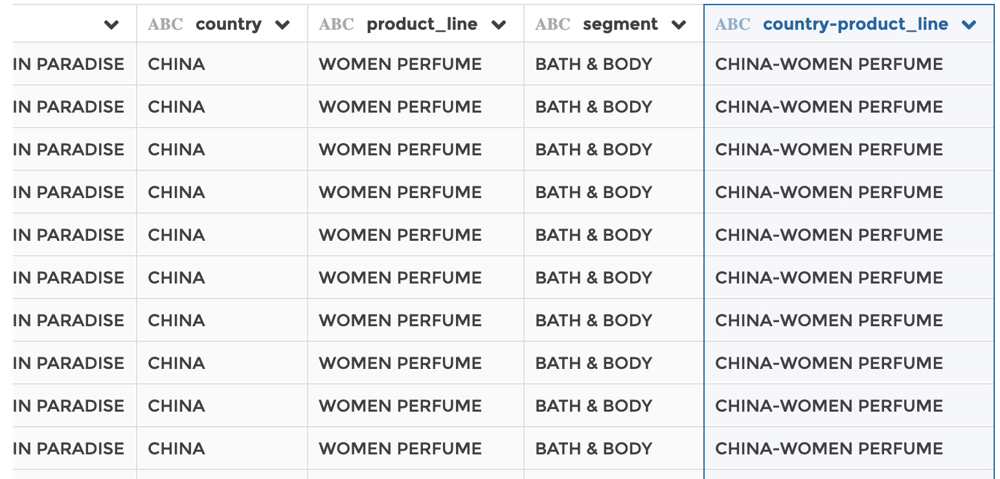

### Concatenate columns

You can use this step to concatenate several text columns.

**This step is supported by the following backends:**

- Mongo 5.0
- Mongo 4.2
- Mongo 4.0
- Mongo 3.6
- Pandas (python)

#### Where to find this step?

- Widget `Text`
- Search bar

#### Options reference

- `Columns to concatenate`: in this section of the form you can specify one or
  more columns to concatenate.

- `Separator`: a character or a string of characters to be used as a separator
  between concatenated columns. Can be left empty if no separator has to be
  used.

- `New column name`: the name of the new column where will be written the
  concatenation result

#### Example

This configuration results in:

