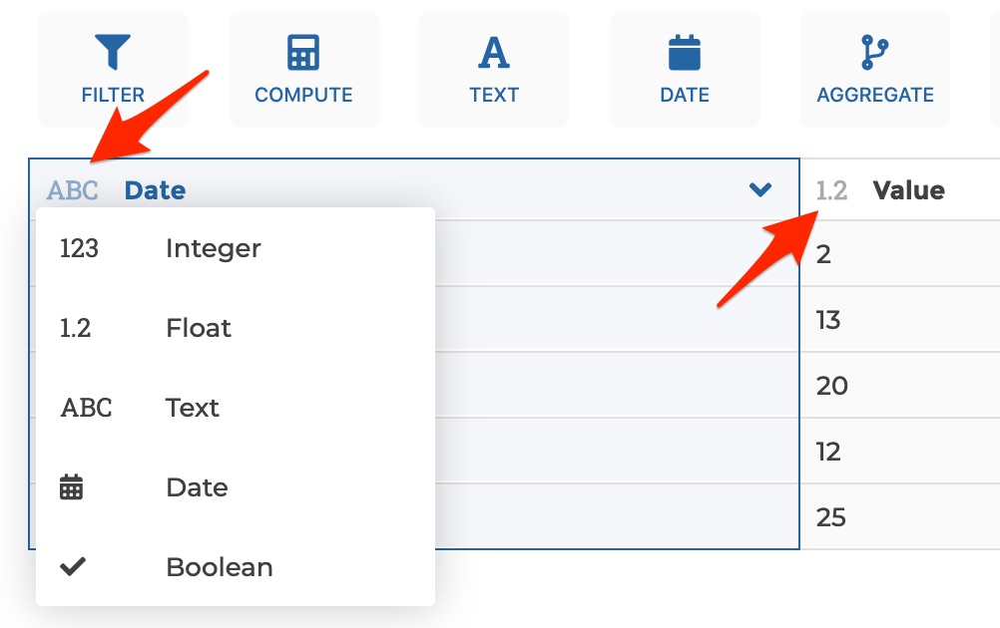
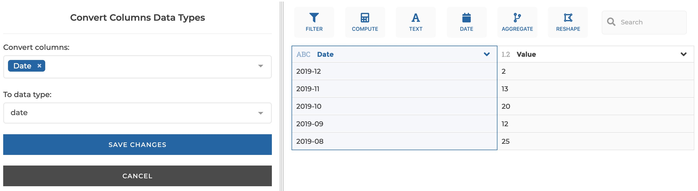
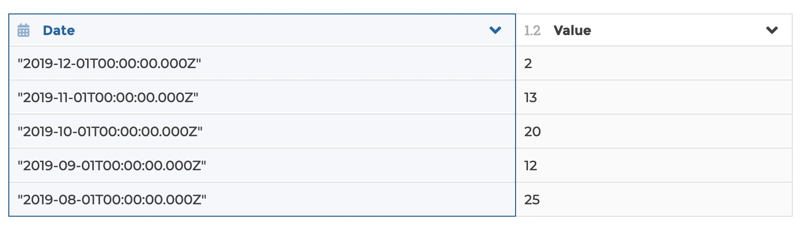

### Convert columns data type

You can use this step to cast column data types.

**This step is supported by the following backends:**

- Mongo 5.0
- Mongo 4.2
- Mongo 4.0
- Pandas (python)

#### Where to find this step?

- Column header data type icon
- Search bar

#### Options reference

- `Convert columns:`: the columns to convert

- `To data type:`: the data type to convert into, either 'integer', 'float',
  'text', 'date' or 'boolean'

#### Example

This configuration results in:

