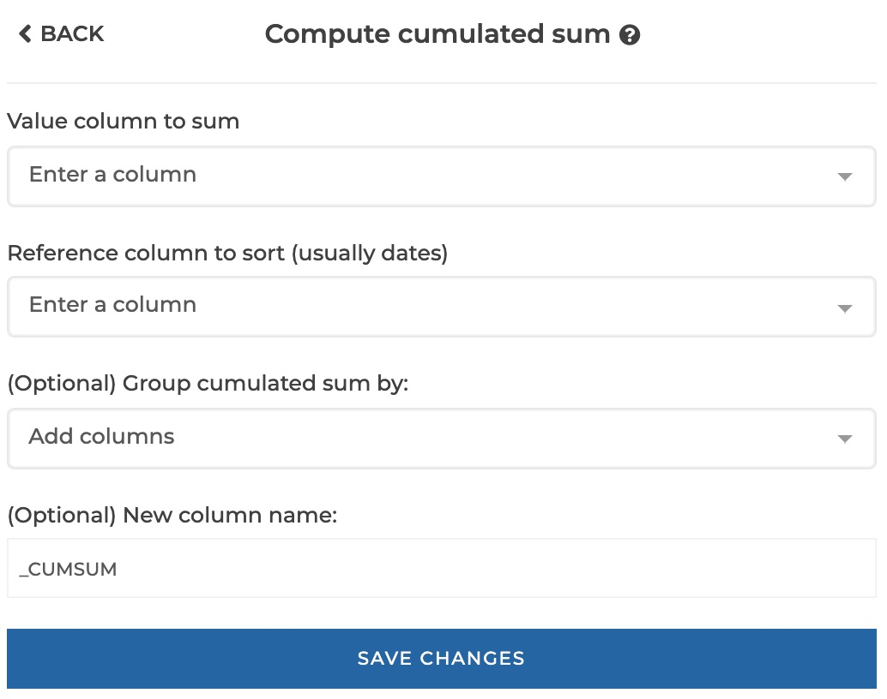
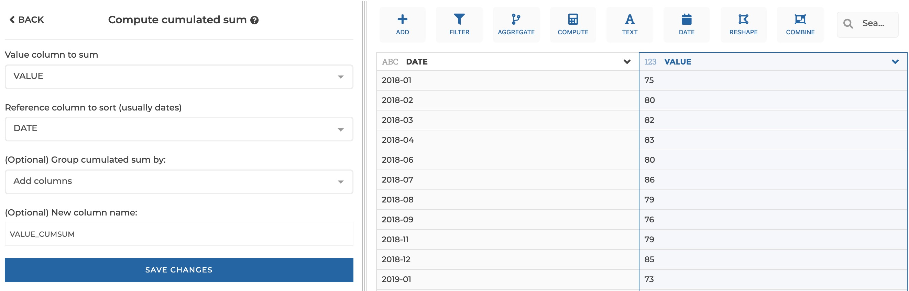
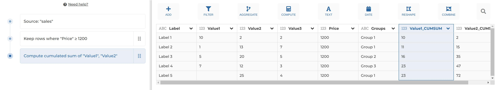
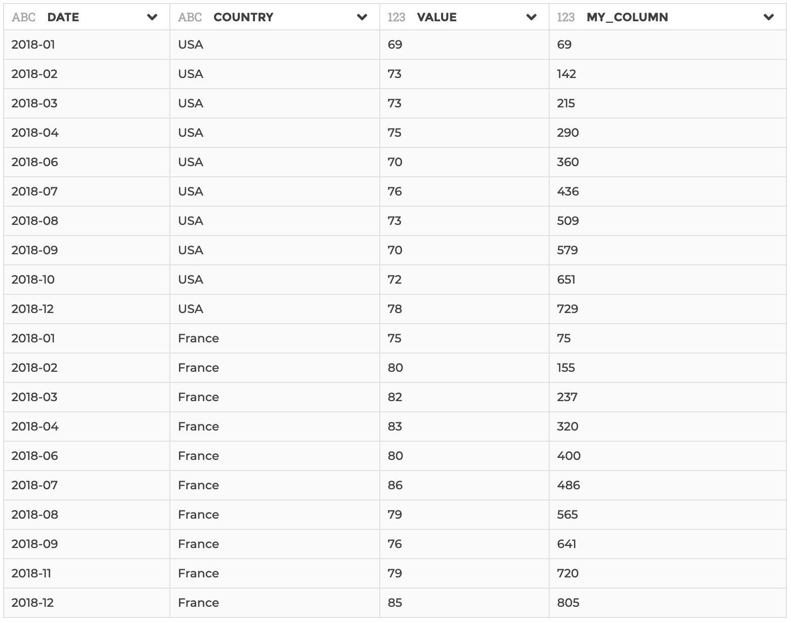

### Cumulated sum

This step allows to compute the cumulated sum of value column based on a
reference column (usually dates) to be sorted by ascending order for the needs
of the computation. The computation can be scoped by group if needed.

**This step is supported by the following backends:**

- Mongo 5.0
- Mongo 4.2
- Mongo 4.0
- Mongo 3.6

#### Where to find this step?

- Widget `Compute`
- Search bar

#### Options reference

- `Value column to sum`: the value column you want to compute the cumulated sum
  of.

- `Reference column to sort (usually dates)`: the column that will be used to
  order rows in ascending order. Usually you will use a date column here
  (to compute a year-to-date result for exemple)

- `(Optional) Group cumulated sum by`: optional, if you need to apply the
  cumulated sum computation by group of rows, you may specify here the columns
  to be used to constitute groups (see example 2 below)

- `(Optional) New column name`: Optional, if you want to give a custom name to
  the output column to be created (by default it will be your original columnn
  name suffixed by '\_CUMSUM').

#### Example 1 : Basic configuration

This configuration results in:

#### Example 2 : Configuration with optional parameters

This configuration results in:

