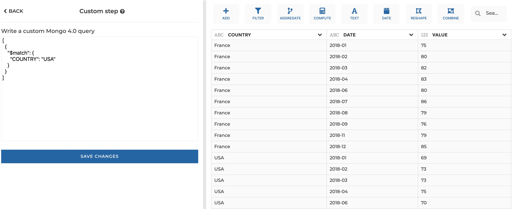

### Custom step

You can use this step to write your own query.

**This step is supported by the following backends:**

- Mongo 4.0
- Mongo 3.6

#### Where to find this step?

- Widget `Add`
- Search bar

#### Options reference

For Mongo, you are expected to write an Aggregation Pipeline query. Please see
the [dedicated documentation](https://docs.mongodb.com/manual/reference/operator/aggregation-pipeline/)
for more information.

#### Example

This configuration results in:

