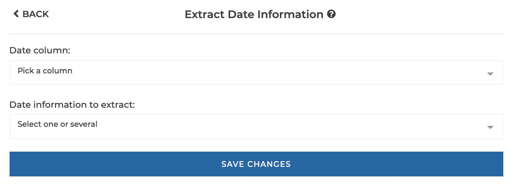
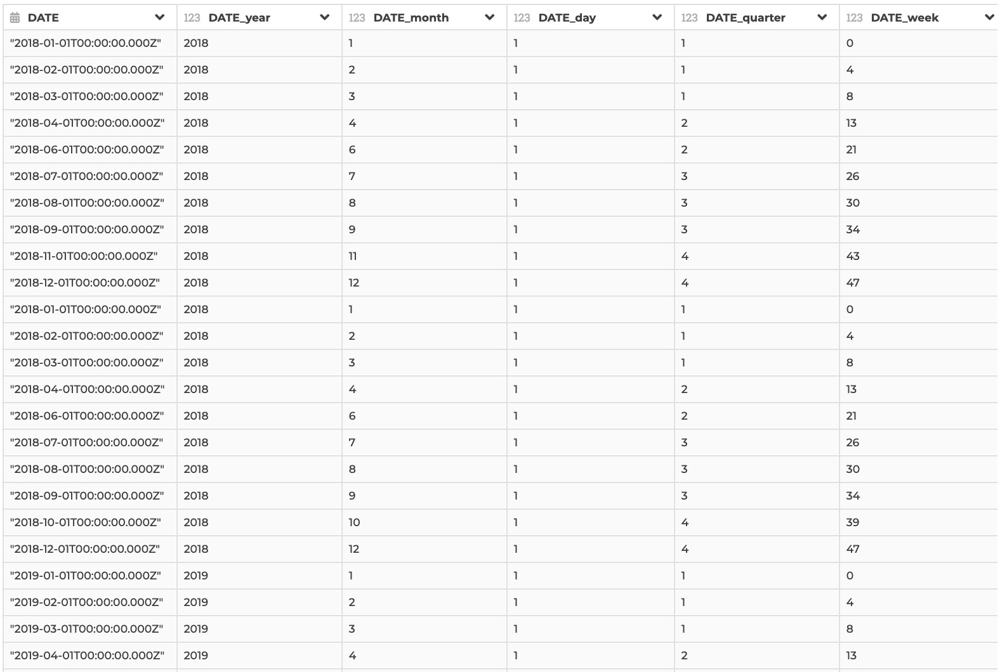

### Extract date information

Use this step if you need to extract date information from a date column (e.g.
the `year` or the `month`).

The following information can be extracted:

- `year'`: extract 'year' from date,
- `month`: extract 'month' from date,
- `day`: extract 'day of month' from date,
- `week`: extract 'week number' (ranging from 0 to 53) from date,
- `quarter`: extract 'quarter number' from date (1 for Jan-Feb-Mar)
- `day of week`: extract 'day of week' (ranging from 1 for Sunday to 7 for
  Staurday) from date,
- `day of year`: extract 'day of year' from date,
- `ISO year`: extract 'year number' in ISO 8601 format (ranging from 1 to 53)
  from date.
- `ISO week`: extract 'week number' in ISO 8601 format (ranging from 1 to 53)
  from date.
- `ISO day of week`: extract 'day of week' in ISO 8601 format (ranging from 1 for
  Monday to 7 for Sunday) from date,
- `first day of year`: calendar dat corresponding to the first day (1st of January) of the year ,
- `first day of month`: calendar dat corresponding to the first day of the month,
- `first day of week`: calendar dat corresponding to the first day of the week,
- `first day of quarter`: calendar dat corresponding to the first day of the quarter,
- `first day of ISO week`: calendar dat corresponding to the first day of the week in ISO 8601 format,
- `previous day`: calendar date one day before the target date,
- `first day of previous year`: calendar dat corresponding to the first day (1st of January) of the previous year,
- `first day of previous month`: calendar dat corresponding to the first day of the previous month,
- `first day of previous week`: calendar dat corresponding to the first day of the previous week,
- `first day of previous ISO week`: calendar dat corresponding to the first day of the previous ISO week,
- `first day of previous quarter`: calendar dat corresponding to the first day of the previous quarter,
- `previous year number`: extract previous 'year number' from date,
- `previous month number`: extract previous 'month number' from date,
- `previous week number`: extract previous 'week number' from date,
- `previous quarter number`: extract previous 'quarter number' from date,
- `previous ISO week number`: extract previous 'week number' in ISO 8601 format (ranging from 1 for Monday to 7 for Sunday)from date,
- `hour`: extract 'hour' from date,
- `minutes`: extract 'minutes' from date,
- `seconds`: extract 'seconds' from date,
- `milliseconds`: extract 'milliseconds' from date,

**This step is supported by the following backends:**

- Mongo 4.2
- Mongo 4.0
- Mongo 3.6
- Pandas (python)

#### Where to find this step?

- Widget `Date`
- Search bar

#### Options reference

- `Date column:`: specify the date column to extract information from
  (the column must be of date data type),

- `Date information to extract...`: the type of information to extract (e.g.
  `year`, `month`). You can select several information to extract at once.

#### Example

This configuration results in:

The hour property is extracted from the `Transaction_date` column.
