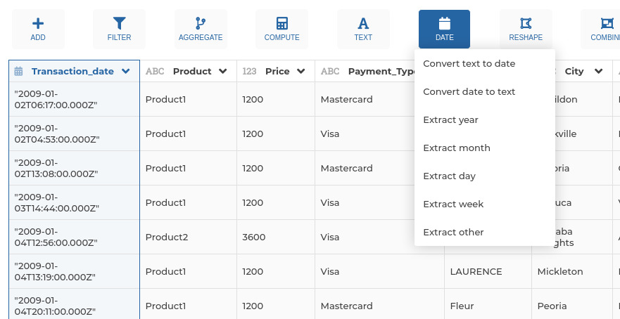

### Extract date property

Use this step if you need to extract a part of a date (e.g. the `year` or the `month`.
The following properties can be extracted:

- `year'`: extract 'year' from date,
- `month'`: extract 'month' from date,
- `day'`: extract 'day of month' from date,
- `hour'`: extract 'hour' from date,
- `minutes'`: extract 'minutes' from date,
- `seconds'`: extract 'seconds' from date,
- `milliseconds'`: extract 'milliseconds' from date,
- `dayOfYear'`: extract 'day of year' from date,
- `dayOfWeek'`: extract 'day of week' from date,
- `week'`: extract 'week number' from date.

**This step is supported by the following backends:**

- Mongo 4.2
- Mongo 4.0
- Mongo 3.6
- Pandas (python)

#### Where to find this step?

- Widget `Date`
- Search bar

#### Options reference

- `Column to work on...`: specify which column the extraction will operate on,

- `Property to extract...`: the type of property the pipeline should extract (e.g. `year`, `month`)

- `New column name...`: the column where the result will be stored. If unspecified, the column
  will be named after both the original date column and the type of operation (e.g. `mycolumn_hour`)

#### Example

This configuration results in:

The hour property is extracted from the `Transaction_date` column.
