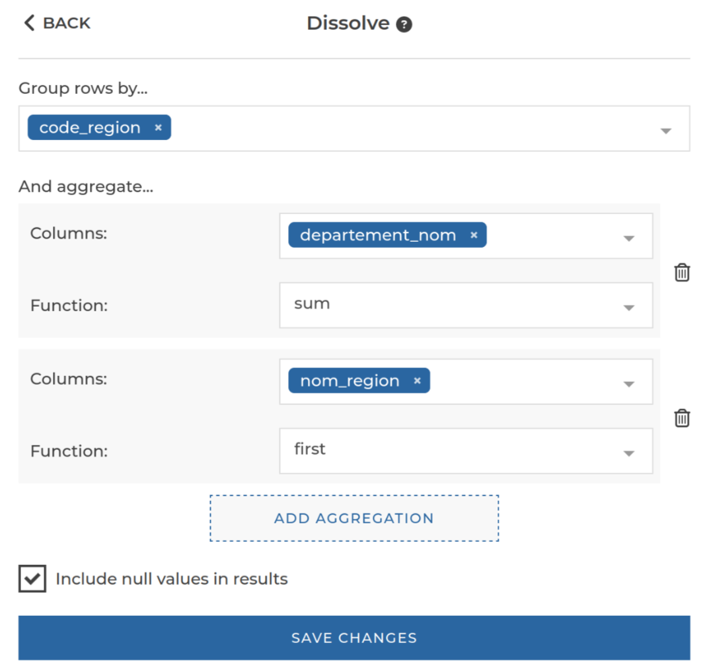

### Geographical dissolve

You can use this step to geographically dissolve columns. For example, to merge different
countries into a single continent.

**This step is supported by the following backends:**

- Pandas (python)

#### Where to find this step?

- `Geo` widget
- Search bar

#### Options reference

- `Group rows by...`: The column(s) by which data to dissolve should be grouped
- `And aggregate...`: Optional. The column(s) you wish to aggregate in addition to the column containing geo data. See
  [`aggregate`](/docs/aggregate/) step for details on the format.
