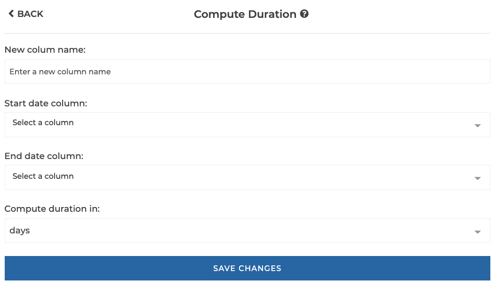
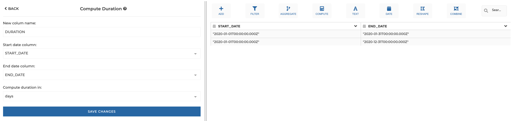
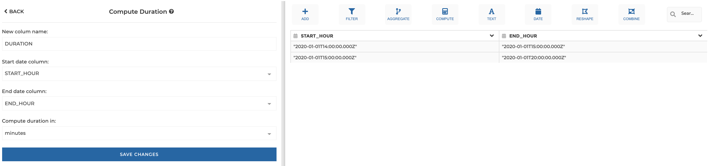
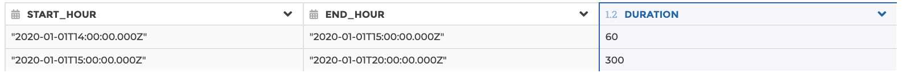

### Compute Duration

Compute the duration (in days, hours, minutes or seconds) between 2 dates in a
new column.

**This step is supported by the following backends:**

- Mongo 4.0
- Mongo 3.6

#### Where to find this step?

- Widget `Dates`
- Search bar

#### Options reference

- `New column name`: the new column to be created for the computation result

- `Start date column`: the starting date

- `End date column`: the ending date

- `Duration in`: the duration units (days, hours, minutes or seconds)

#### Example 1: duration in days

This configuration results in:

#### Example 2: duration in minutes

This configuration results in:

