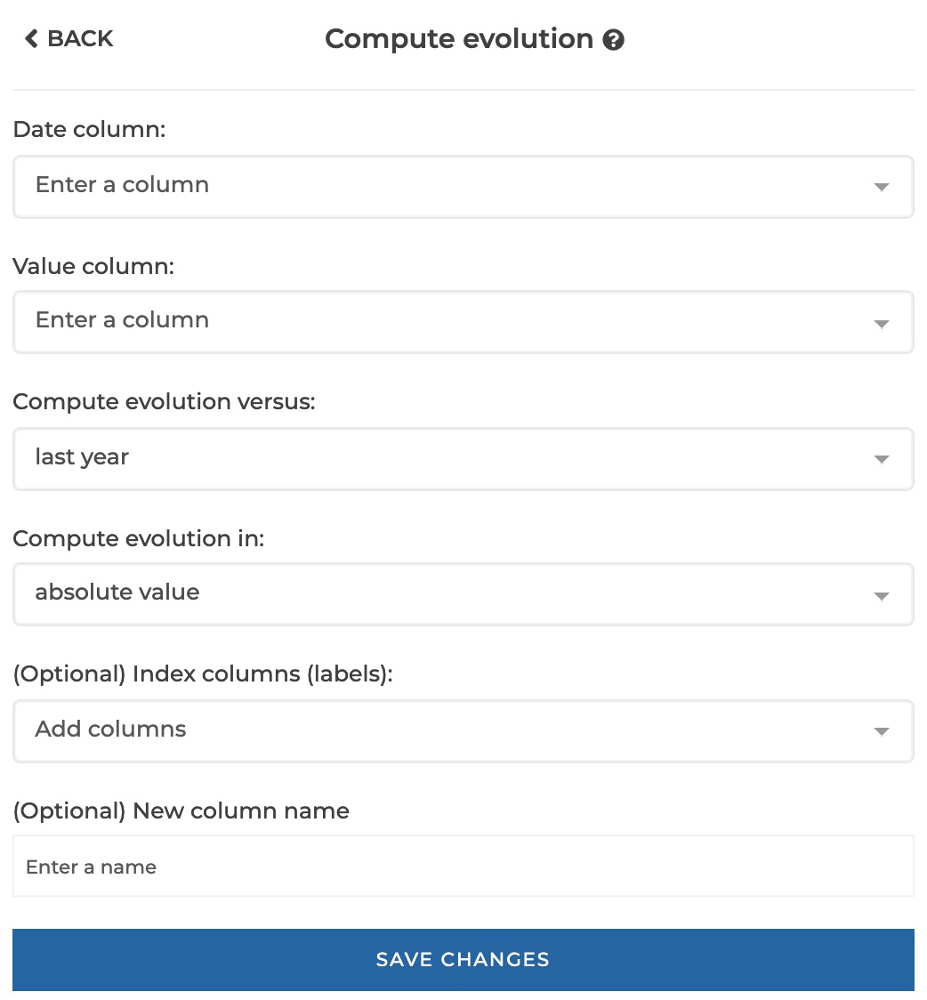
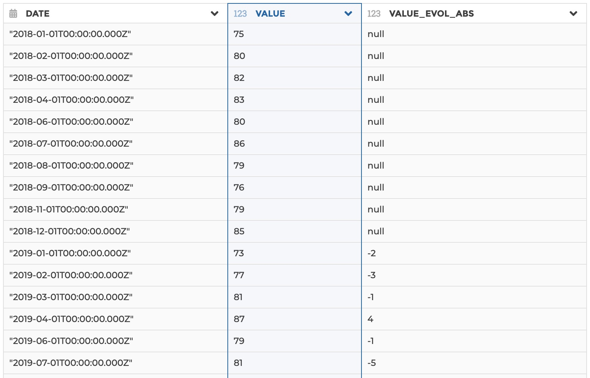
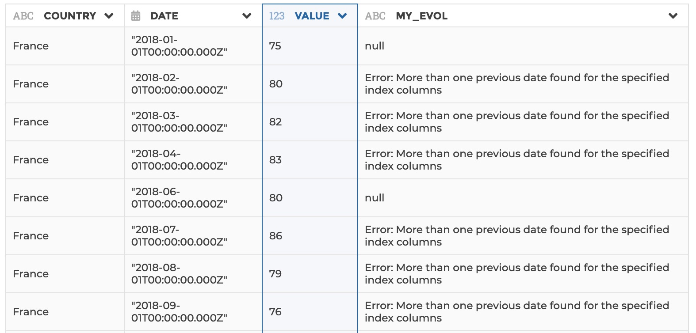
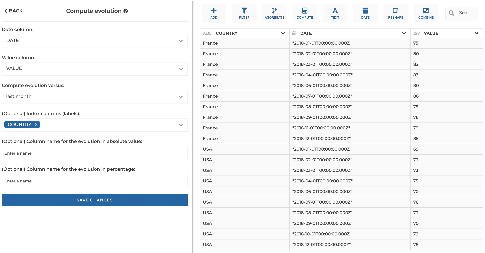

### Compute evolution

You can use this step if you need to compute the row-by-row evolution of a value
column, based on a date column. It will output 2 columns: one for the evolution
in absolute value, the other for the evolution in percentage.

You must be careful that the computation is scoped so that there are no dates
duplicates (so that any date finds no more than one previous date). That means
that you may need to specify index columns to make any date unique by index. You
should use the `indexColumns` parameter to specifiy what series of columns
allows to build a unique index (by concatenation with the date column).
If index is not unique and more than one previous date is found, you will get
an error at row level ("Error: More than one previous date found for the
specified index columns"). Please refer to example 2 and 3 below for a concrete
illustration.

**This step is supported by the following backends:**

- Mongo 4.0
- Mongo 3.6
- Pandas (python)

#### Where to find this step?

- Widget `Compute`
- Search bar

#### Options reference

- `Date column`: the date column (must be of type date) that will be used as a
  reference for the computation

- `Value column`: the value column that you want to compute the evolution of

- `Compute evolution vs`: whether you want to compute evolution versus last year,
  last month, last week or last day

- `(Optional) Index columns (labels)`: (optional). Use this option if you need
  to specify index columns to make every date unique by index (the logic is
  similar as a "group by"). See examples 2 and 3 for a concrete illustration.

- `(Optional) New column name`: (optional). Use this option if you want to give
  a custom name to the output column. By default, it will be your original
  column name suffixed with either "\_EVOL_ABS" or "\_EVOL_ABS" depending on the
  kind of evolution that you chose.

- `(Optional) Column name for the evolution in percentage`: (optional). Use this
  option if you want to give a custom name to the output column that will show
  the evolution in percentage. By default, it will be your original column name
  suffixed with "\_EVOL_PCT"

#### Example 1: Basic configuration

This configuration results in:

#### Example 2: Error on duplicate dates

This configuration results in:

#### Example 3: Complete configuration with index columns

This configuration results in:

