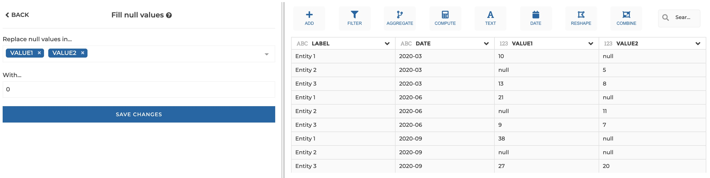
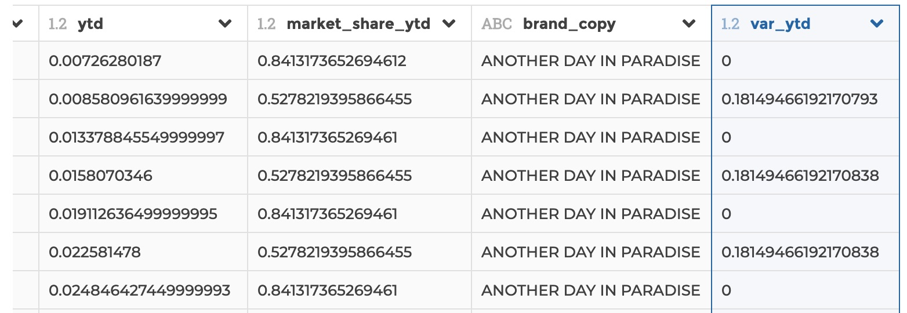

### Fill null values

You can use this step to fill null values in specified columns with a value of
your choice.

**This step is supported by the following backends:**

- Mongo 4.0
- Mongo 3.6
- Pandas (python)

#### Where to find this step?

- Column header menu
- Search bar

#### Options reference

- `Replace null values in...`: the target columns

- `With...`: the value that will replace null values

#### Example

This configuration results in:

