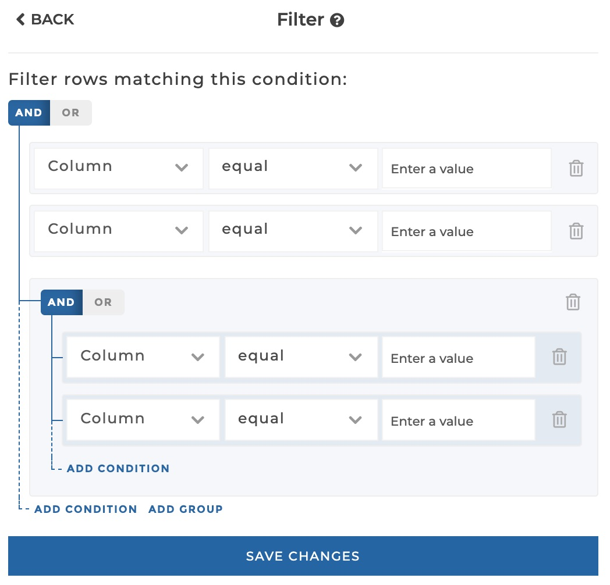
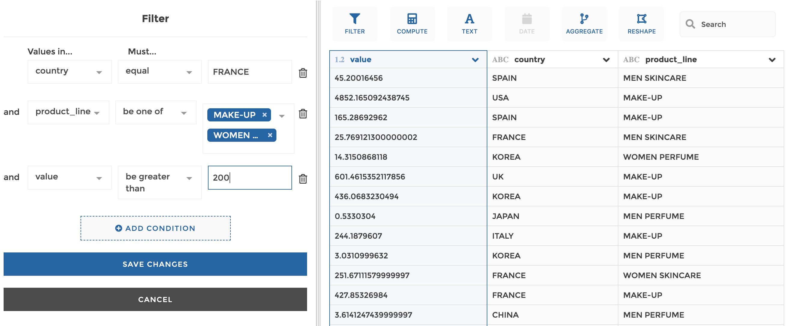
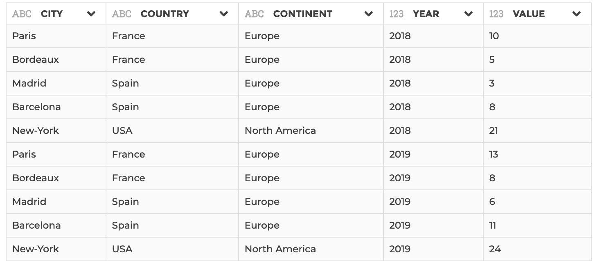

### Filter rows

You can use this step to filter rows based on one or several conditions. At the
moment, we only support `and` as logical link between conditions.

**This step is supported by the following backends:**

- Mongo 4.0
- Mongo 3.6

#### Where to find this step?

- Column header menu
- Widget `Filter`
- Search bar

#### Options reference

- `Values in ...`: the target column

- `Must...`: a comparison operator (equal, not equal etc.)

- Then you can enter value(s) to be compared to. For `be one of` and `not be one
  of` operators, you can enter several values. For the `be null` and `not be
  null` operators, you do not need to enter any value as it is a comparison
  aginst `null` values. `matches` and `notmatches` operators are used to test
  value against a regular expression.

- `Add condition`: use this button if you need to add a new condition line. The
  retained rows will be those match every condition (logical `and`)

#### Example

This configuration results in:

