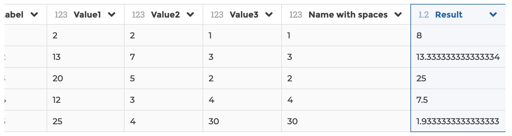
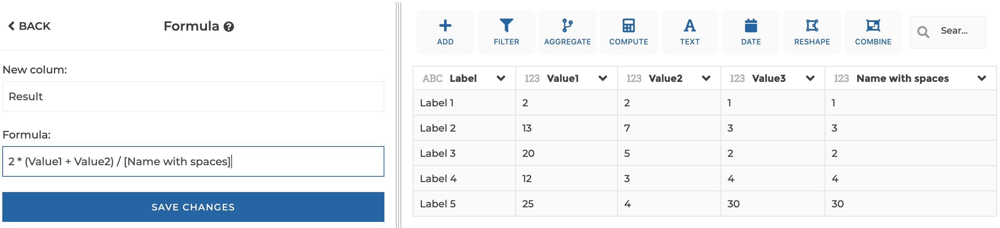
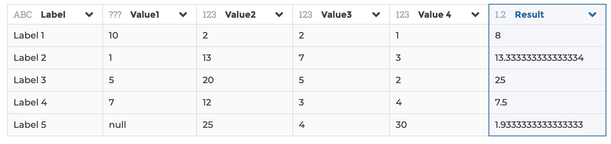

### Formula

You can use this step to create a column as a formula based on other columns.
A column can be referenced by its name without quotes unless they include
whitespaces, in such a case you need to use brackets '[]' (e.g. \[myColumn]).

Any characters string escaped with quotes (simple or double) will be considered
as a string.

**This step is supported by the following backends:**

- Mongo 4.0
- Mongo 3.6

#### Where to find this step?

- Widget `Add` and `Compute`
- Search bar

#### Options reference

- `New column`: the name of the new column to be created with the formula
  result.

- `Formula`: the formula, which can be an algebraic formula composed of numbers,
  maths operators and columns; it can also be a text (escaped by quotes) to
  uniformly fill the column with that text.

#### Example 1: Basic usage

This configuration results in:

#### Example 2: Columnn names with whitespaces

This configuration results in:

