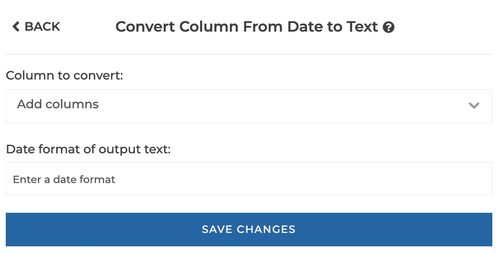
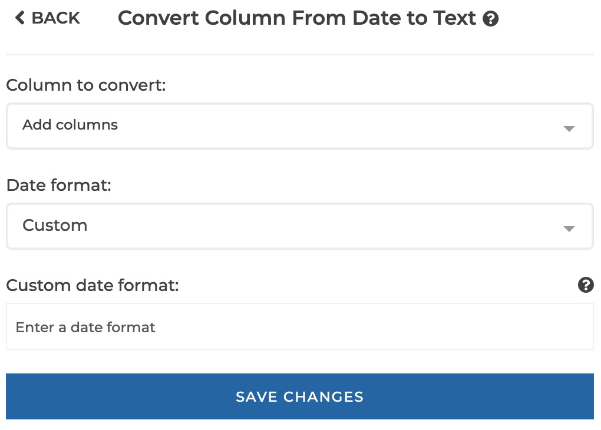
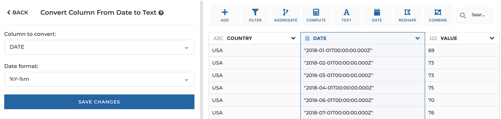
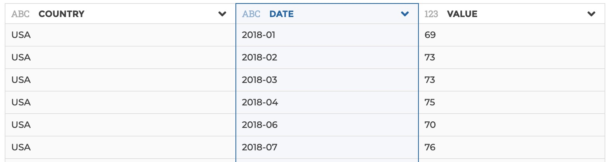

### Convert date column to text

You can use this step to cast a date column to a text column.

**This step is supported by the following backends:**

- Mongo 4.2
- Mongo 4.0
- Mongo 3.6

#### Where to find this step?

- Widget `Date`
- Search bar

#### Options reference

 

 

- `Column to convert:`: the date column to be converted to text

- `Date format:`: either 'Custom' (to allow you to enter a custom format in the
  `custom format` parameter below), or a preset (e.g. "%d-%m-%Y")

- `Custom format:`: only displayed and required if you selected 'custom' in the
  `Date format` parameter. Please see the [Mongo documentation](https://docs.mongodb.com/manual/reference/operator/aggregation/dateFromString/index.html#datefromstring-format-specifiers)
  for Mongo supported formats.

#### Example

This configuration results in:

