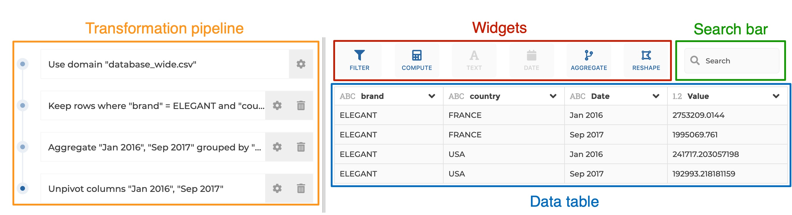
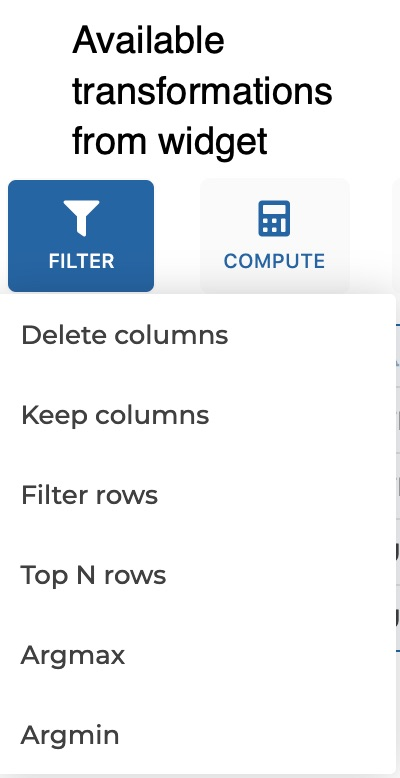
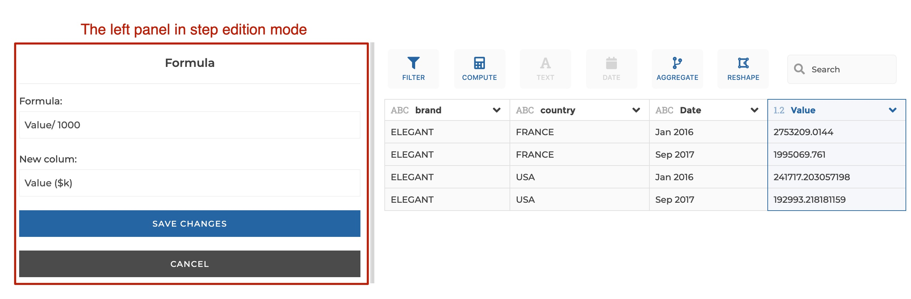
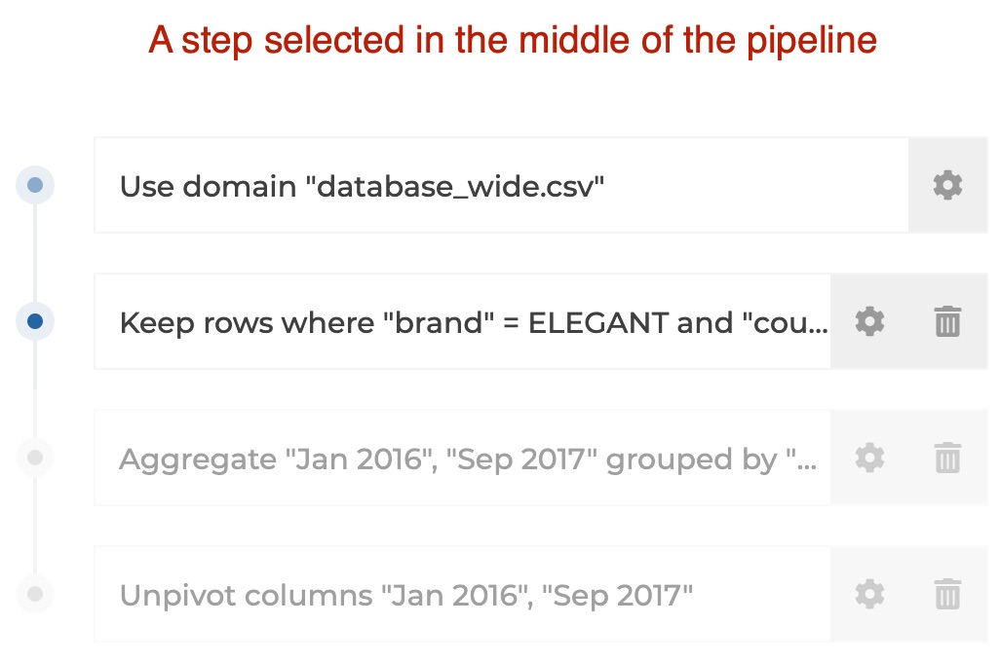

## General principles

The Visual Query Builder interface breaks down into 2 panels:

- the **transformation pipeline on the left**: this is where you can see the
  ordered series of transformation steps that are applied to your data. When you
  need to configure a given step, the left panel switches to the **step edition
  form**

- the **data table on the right**: this is where you can click on your data to apply
  transformations. The right panel also includes **widgets** above the table.
  Transformations are available from the columns headers, from the widgets or
  can be found via the **search bar**.

 
 

&nbsp;&nbsp;&nbsp;&nbsp;&nbsp;&nbsp;&nbsp;&nbsp;&nbsp;&nbsp;&nbsp;&nbsp;&nbsp;
&nbsp;&nbsp;&nbsp;&nbsp;&nbsp;&nbsp;&nbsp;&nbsp;&nbsp;&nbsp;&nbsp;&nbsp;&nbsp;

&nbsp;&nbsp;&nbsp;&nbsp;&nbsp;&nbsp;&nbsp;&nbsp;&nbsp;&nbsp;&nbsp;&nbsp;&nbsp;
&nbsp;&nbsp;&nbsp;&nbsp;&nbsp;&nbsp;&nbsp;&nbsp;&nbsp;&nbsp;&nbsp;&nbsp;&nbsp;

 
 

Everytime you interact with the table or widgets to transform data, the
corresponding step is logged in the transformation pipeline. Any step can be
edited or deleted.
If a step in the middle of the pipeline gets edited or deleted, the following
steps remain unchanged.

If you click on any step of the pipeline, the data table on the right will
update to show you the result of the transformations until this step. Following
steps get greyed to show that they are temporarily disabled and not executed.
In that sense, **the pipeline acts as a history that you can navigate into. It
can be very helpful when debugging!**

You can **insert a step in the middle of the pipeline**. The general rule is
that a step is added immediately after the selected step in the pipeline. So if
you want to insert a step in the midlle of the pipeline, just select the step
after which you need to insert your new step, and apply your transformation.

