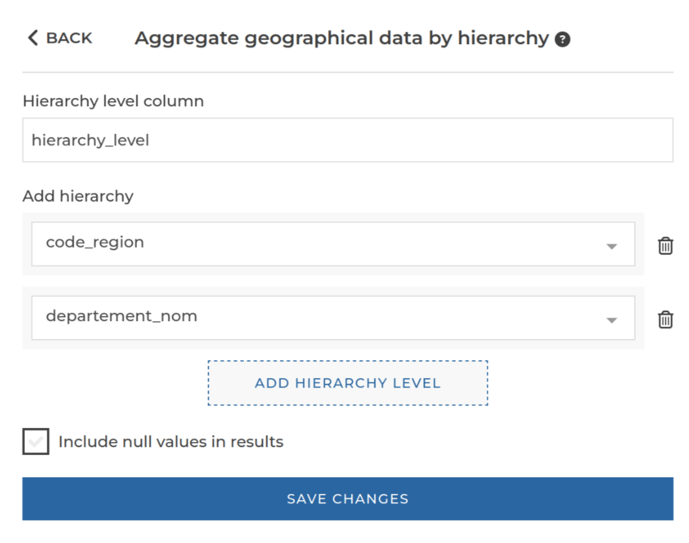

### Geographical hierarchy

You can use this step to set up a geographical hierarchy in your dataset. For example, to merge different
cities into a single country, but still keep the cities level. This is useful in case you want to display a
chart with a geographical drill-down.

**This step is supported by the following backends:**

- Pandas (python)

#### Where to find this step?

- `Geo` widget
- Search bar

#### Options reference

- `Hierarchy level column`: The name of the column in which the hierarchy level should be stored.
- `Add hierarchy`: Allows to add hierarchy levels. At least one hierarchy level must be added.
