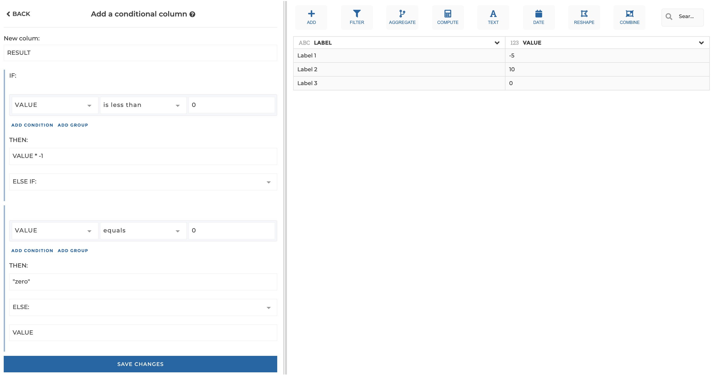
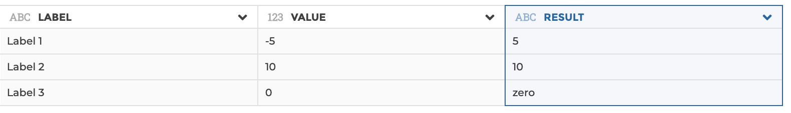

### If...Then...Else

You can use this step to create a new column, which values will depend on a
condition expressed on existing columns.

**This step is supported by the following backends:**

- Mongo 4.0
- Mongo 3.6

#### Where to find this step?

- Widget `Add`
- Search bar

#### Options reference

- `if`: This is where you can specify a condition or a group of conditions.
  Please see the [filter step documentation](https://weaverbird.toucantoco.com/docs/filter/)
  or more dtails on how conditions work.

- `then`: here you can specify the value of the column if the `if` condition is
  evaluated to `true`. This parameter only supports a string, that will be
  interpreted as a formula (please see [formula step documentation](https://weaverbird.toucantoco.com/docs/formula/)
  for more details on how a formula works). If you want it to be interpreted striclty as a string and not a formula, you must
  escape the string with quotes (e.g. "this is a text").

- `else`/`elseif`: here you can specify the value of the column if the `if`
  condition is evaluated to `false`.
  If `else` is selected, you need to specify a string thatinterpreted as a
  formula (please see [formula step documentation](https://weaverbird.toucantoco.com/docs/formula/)
  for more details on how a formula works).
  If `elseif` is specified, you can nest another `if...then...else` block here.

#### Example

This configuration results in:

