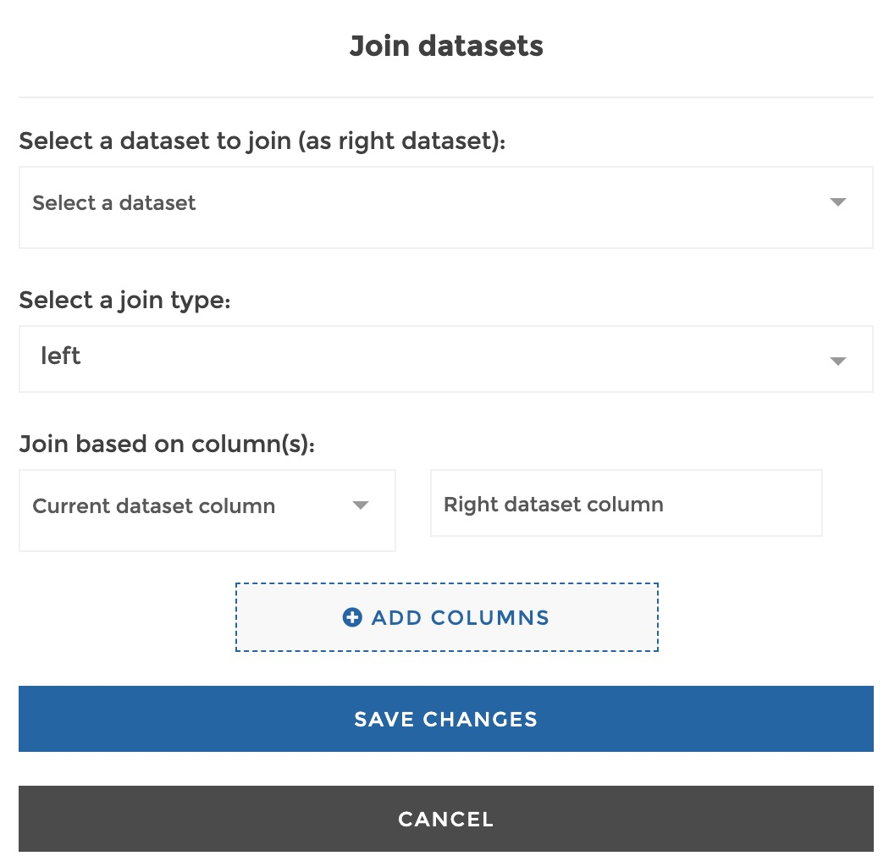
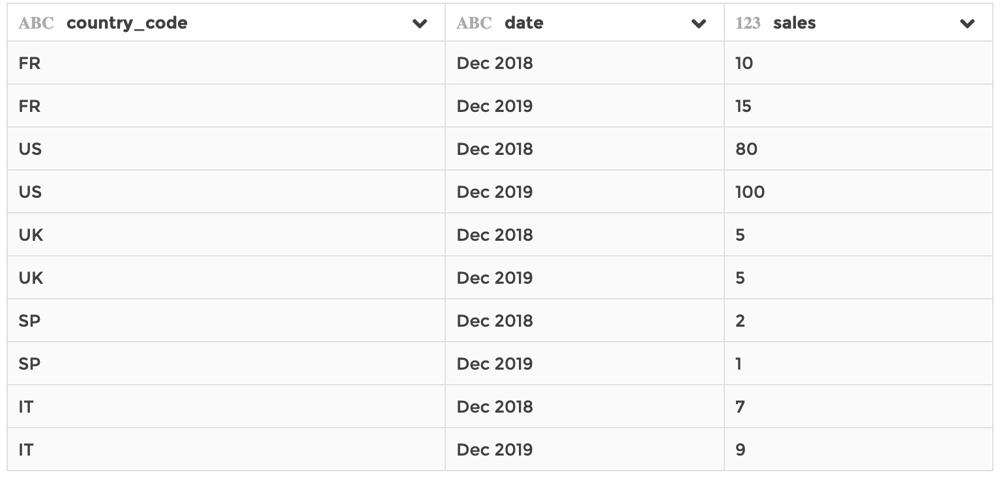
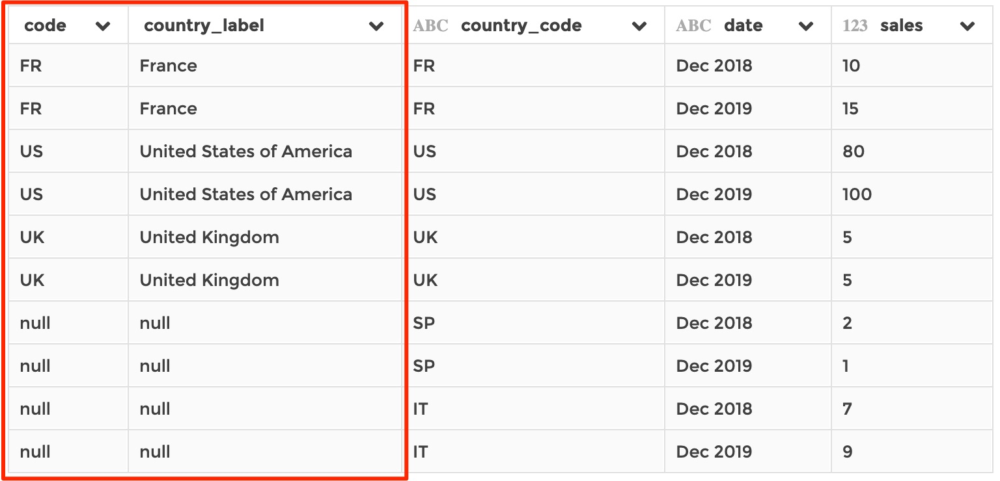
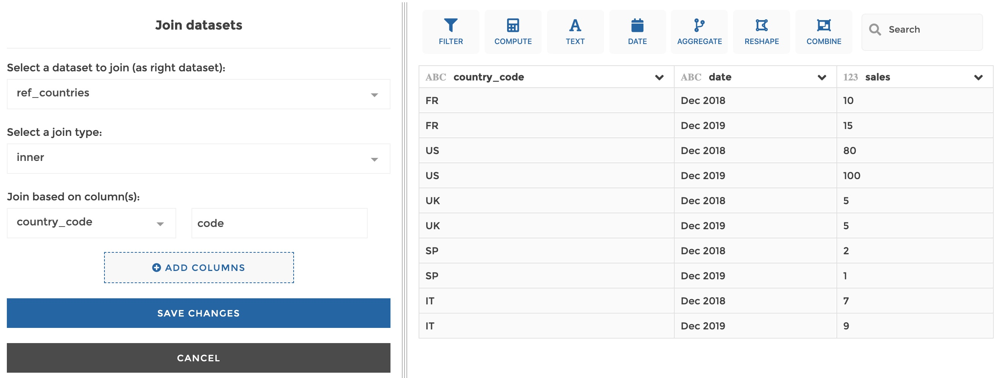
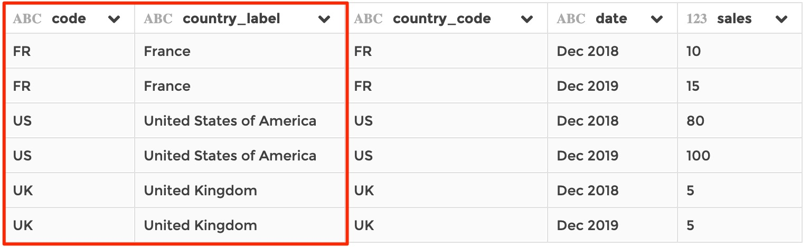
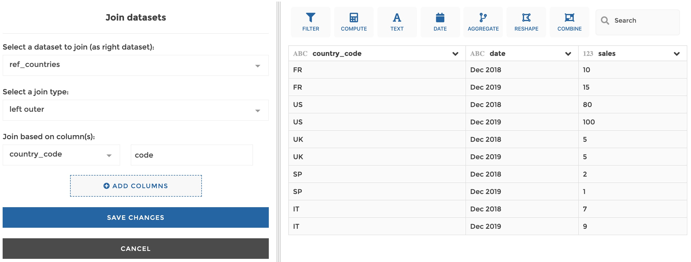
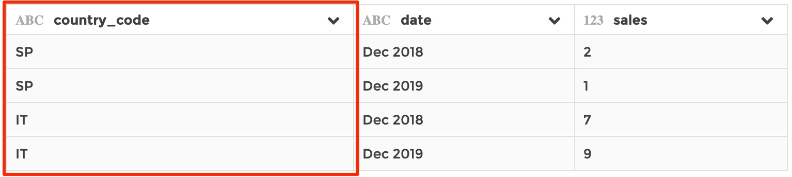

### Join

You can use this step to join a registered dataset to the current dataset, i.e.
to bring columns from the former into the latter, matching rows based `on`
columns correspondance. It is similar to a `JOIN` clause in SQL, or to a
`VLOOKUP` in Excel.

**This step is supported by the following backends:**

- Mongo 5.0
- Mongo 4.2
- Mongo 4.0
- Mongo 3.6
- Pandas (python)

#### Where to find this step?

- Widget `Combine`
- Search bar

#### Options reference

- `Select a dataset to join (as right dataset):`: the name of the dataset you
  want to append to join to the current dataset

- `Select a join type`: either `left` or `inner`:

  - `left`: will keep every row of the current dataset and fill unmatched rows
    with `null` values,

  - `inner`: will only keep rows that match rows of the joined dataset.

- `Join based on column(s):`: specify 1 or more column couple(s) that will be
  compared to determine rows correspondance between the 2 datasets. The first
  element of a couple is for the current dataset column, and the second for the
  corresponding column in the right dataset to be joined. If you specify more
  than 1 couple, the matching rows will be those that find a correspondance
  between the 2 datasets for every column couple specified (logical 'AND').

#### Example 1: left join on 1 column

Say your dataset being currently edited looks like this:

And say you have a dataset, stored in your application, that references country
labels ased on their country code:

- `ref_countries`:

  

Then if you you apply the following configuration on the current dataset...

...It will result in:

#### Example 2: inner join on 1 column

Based on the same datasets as in example1, if you you apply the following
configuration on the current dataset...

...It will result in:

#### Example 3: join on several columns

Based on the same ase dataset as in example 1, now say that you have a dataset,
stored in your application, that has information on employees number by country
and by date:

- `nb_employees`:

  

You want both the country AND date to be used for matching rows. So if you
apply the following configuration on the current dataset...

...It will result in:

