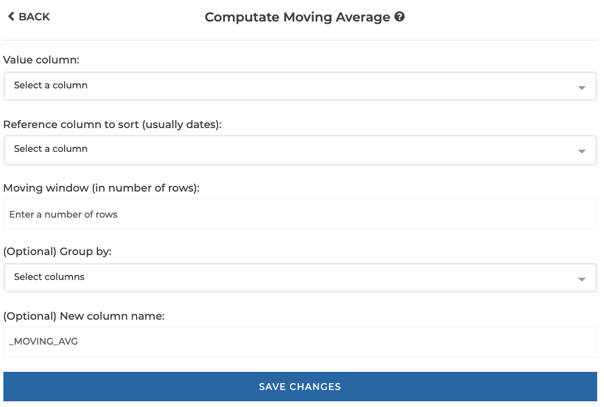
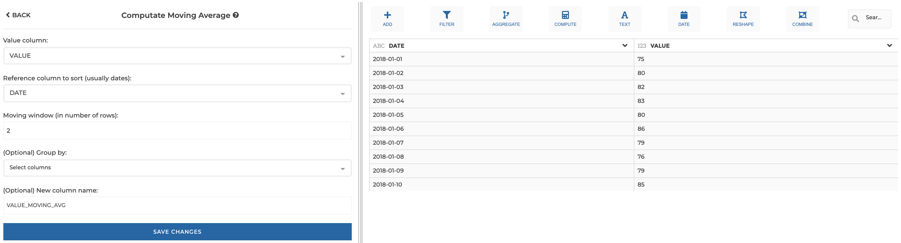
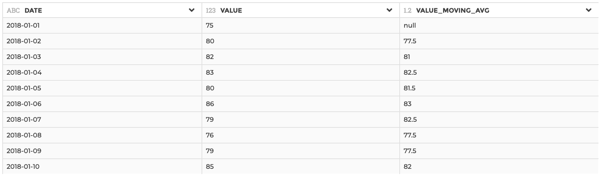
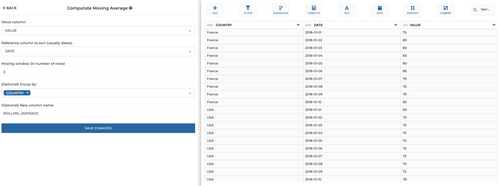
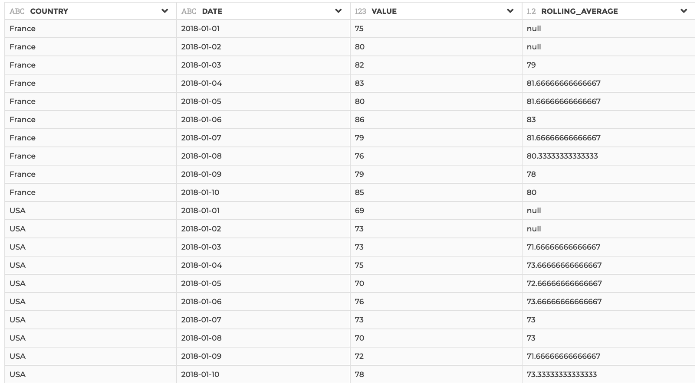

### Compute Moving Average

Use this step to compute a moving average based on a value column, a reference
column to sort (usually a date column) and a moving window (in number of rows).
If needed, the computation can be performed by group of rows.
The computation result is added in a new column.

**This step is supported by the following backends:**

- Mongo 4.0
- Mongo 3.6

#### Where to find this step?

- Widget `Compute`
- Search bar

#### Options reference

- `Value column:`: the value column used as the basis for the moving average
  computation

- `Reference column to sort (usually dates)`: the column used to sort rows

- `Moving window (in number of rows)`: the number of rows included in the moving
  window

- `Group by` (optional): if you want perform the computation by group of rows
  (see example 2 below)

- `New column name` (optional): if you want to specify a custom column name
  (by default, it will be your original value column name suffixed with
  "\_MOVING_AVG")

#### Example 1: Basic usage

This configuration results in:

#### Example 2: with "group by" logic and custom new column

This configuration results in:

