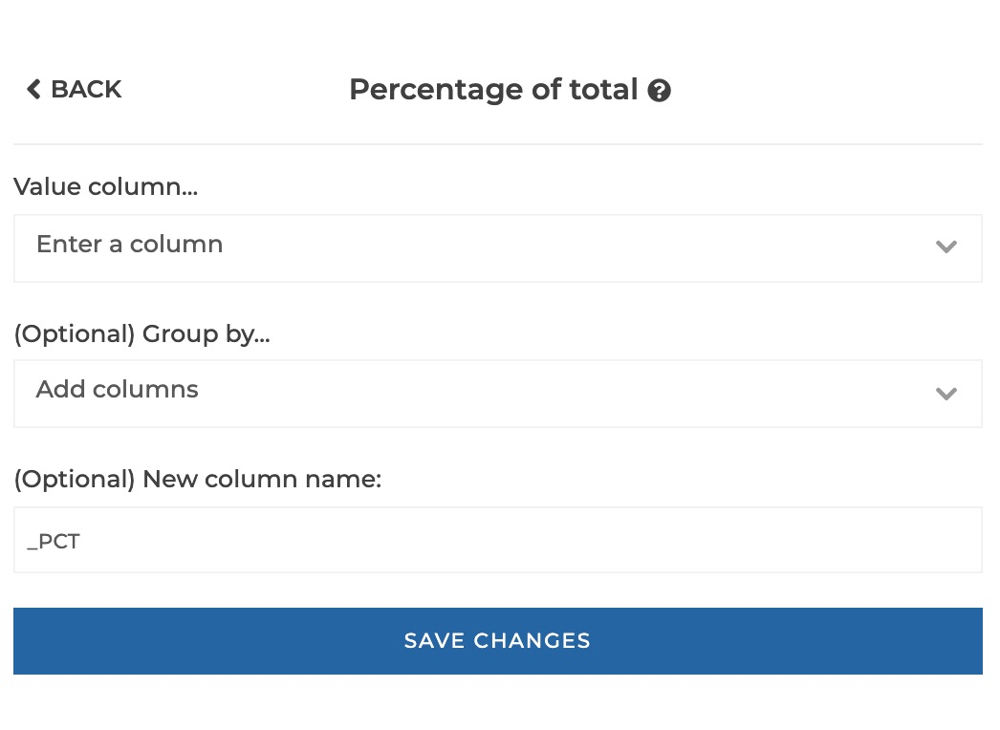
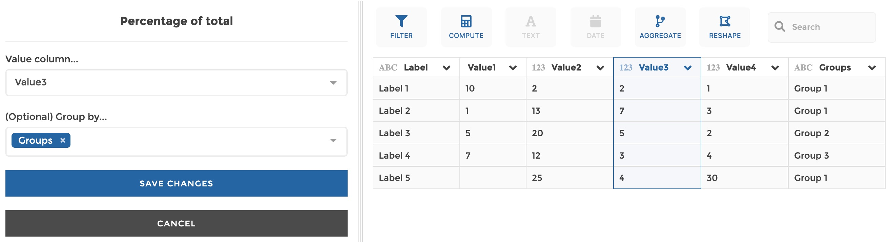

### Percentage

Compute the percentage of total as the share of every row in the column total.
The computation can be performed by group if specified (i.e. the percentage of
total will be computed inside every group, as the share of every row in the
total of its group).

**This step is supported by the following backends:**

- Mongo 4.2
- Mongo 4.0
- Mongo 3.6

#### Where to find this step?

- Widget `Compute`
- Search bar

#### Options reference

- `Value column...`: The column that will be used for the computation

- `Group by...` (optional): if you want the computation to be segmented by
  group, you can select one or several columns that will be used to constitute
  unique groups (equivalent to the columns that you would specify after the
  `GROUP BY` clause in SQL or in the `_id` field of a `$group` in Mongo
  aggregation pipeline)

- `New colum name:` (optional): if you want to give a custom name to the column
  of results to be created. By default, it will be your original column name
  suffixed by '\_PCT'.

#### Example

This configuration results in:

