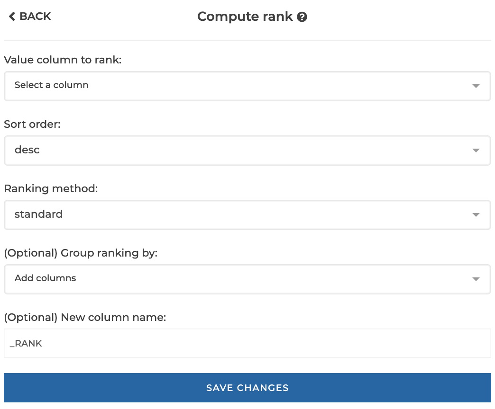
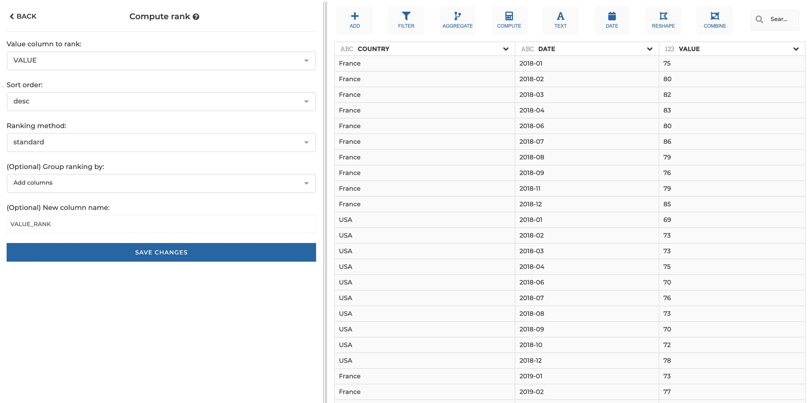
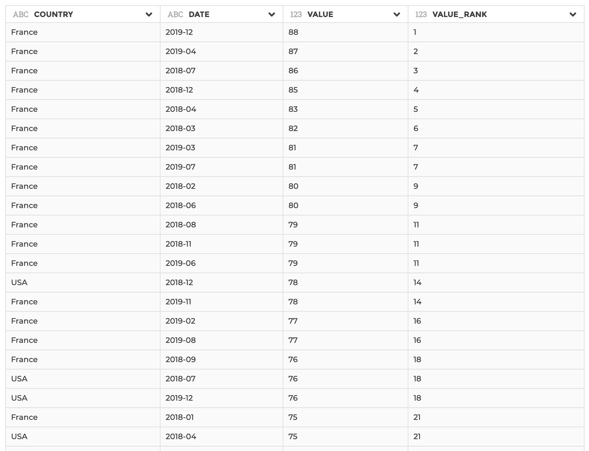
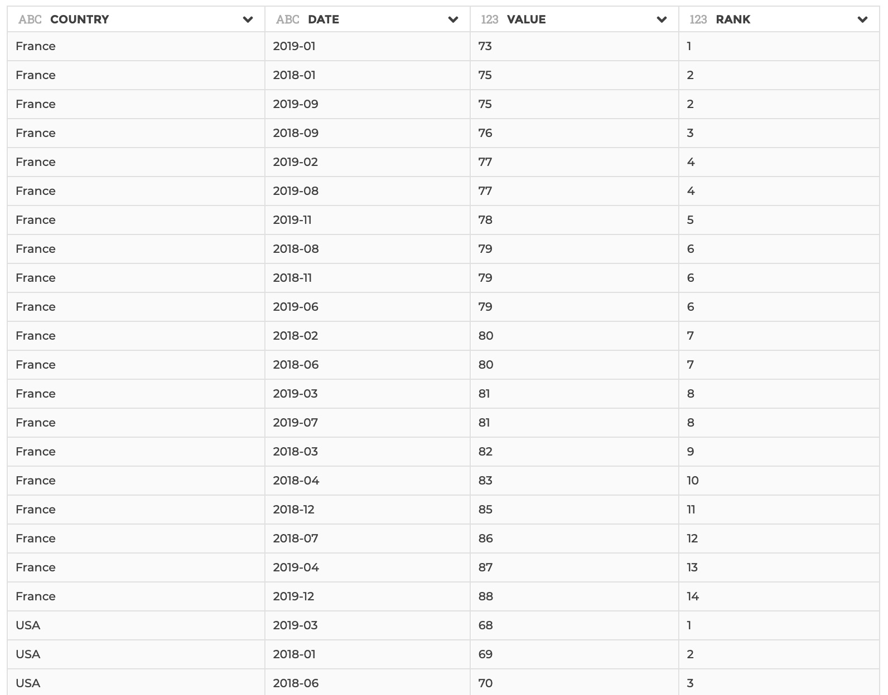

### Rank

This step allows to compute a rank column based on a value column that can be
sorted in ascending or descending order. The ranking can be computed by group.

There are 2 ranking methods available, that you will understand easily through
those examples:

- `standard`: input = [10, 20, 20, 20, 25, 25, 30] => ranking = [1, 2, 2, 2, 5, 5, 6]
- `dense`: input = [10, 20, 20, 20, 25, 25, 30] => ranking = [1, 2, 2, 2, 3, 3, 4]

(The `dense` method is basically the same as the `standard` method, but rank
always increases by 1 at most).

**This step is supported by the following backends:**

- Mongo 5.0
- Mongo 4.2
- Mongo 4.0
- Mongo 3.6

#### Where to find this step?

- Widget `Compute`
- Search bar

#### Options reference

- `Value column to rank`: the value column that will be ordered to determine rank

- `Sort order`: how to order the value column to determine ranking. Either
  asc(ending) or desc(ending), 'desc' by default

- `Ranking method`: either 'standard' or 'dense', as explained above

- `(Optional) Group ranking by`: optional, if you need to apply the
  ranking computation by group of rows, you may specify here the columns
  to be used to constitute groups (see example 2 below)

- `(Optional) New column name`: Optional, if you want to give a custom name to
  the output column to be created (by default it will be your original column
  name suffixed by '\RANK').

#### Example 1 : Basic configuration

This configuration results in:

#### Example 2 : Configuration with optional parameters

This configuration results in:

