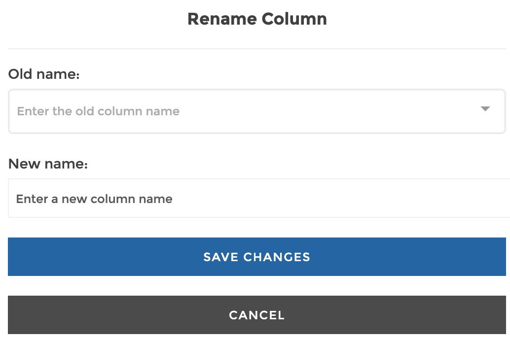
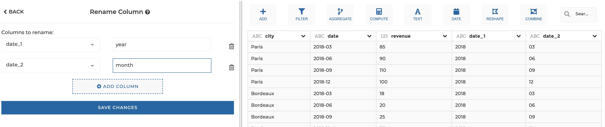
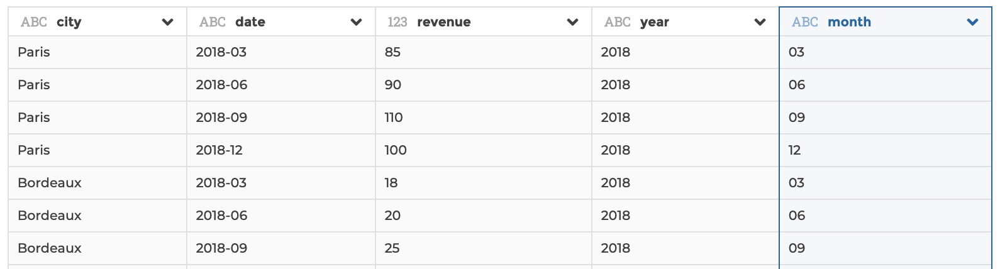

### Rename column

You can use this step to rename a column.

**This step is supported by the following backends:**

- Mongo 4.0
- Mongo 3.6

#### Where to find this step?

- Column header menu
- Search bar

#### Options reference

- `Columns to rename`: you can specify one or more columns to rename, with their
  corresponding new column name

#### Example

This configuration results in:

