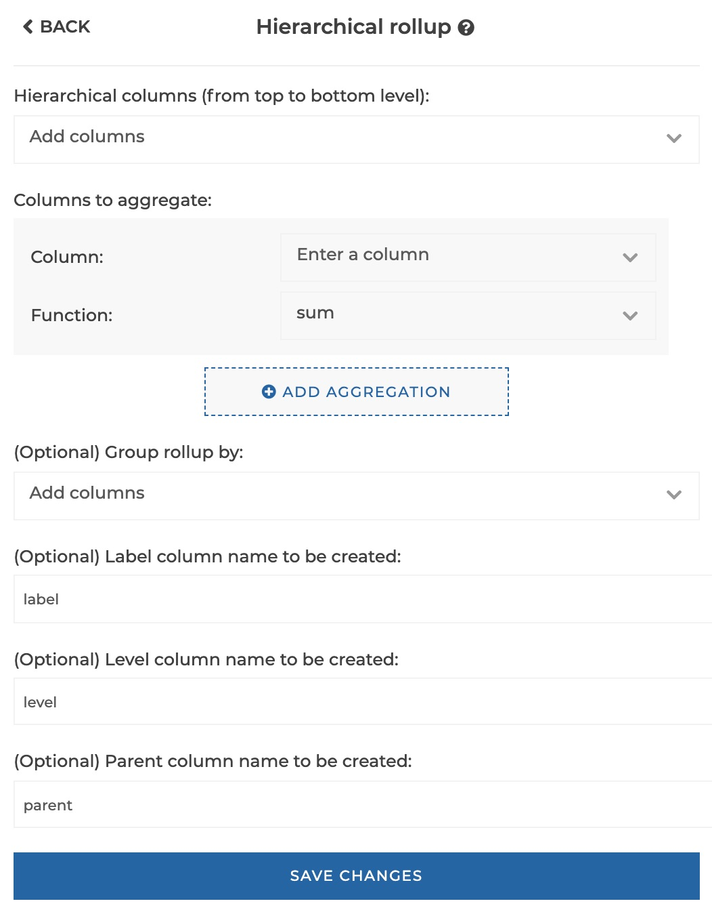
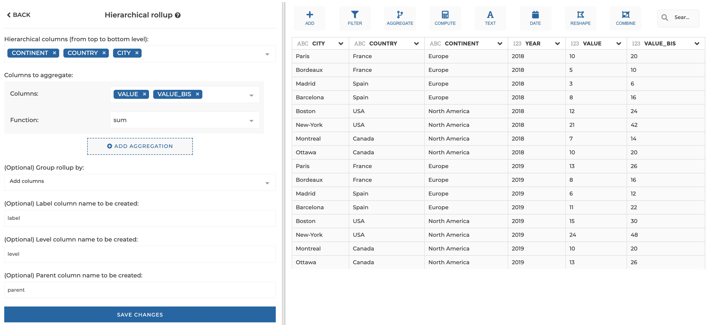
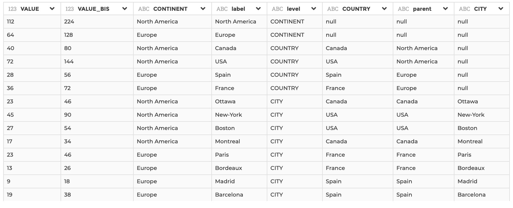
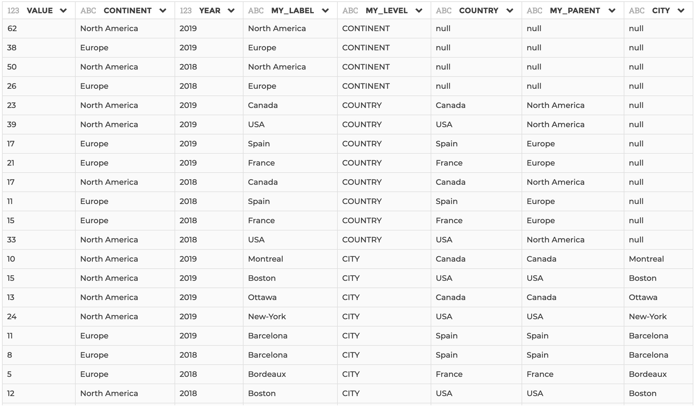

### Hierarchical rollup

You can use this step if you need to compute aggregated data at every level of a
hierarchy, specified as a series of columns from top to bottom level.
The output data structure stacks the data of every level of the hierarchy,
specifying for every row the label, level and parent in dedicated columns.

Aggregated rows can be computed with using either sum, average, count, count distinct,
min, max, first or last.

**This step is supported by the following backends:**

- Mongo 4.2
- Mongo 4.0
- Mongo 3.6
- Pandas (python)

#### Where to find this step?

- Widget `Aggregate`
- Search bar

#### Options reference

- `Hierarchal columns (from top to bottom level)`: here you must specify the
  list of columns that have a hierarchical link, in hierarchical order from
  top to bottom level.

- `(Optional) Columns to aggregate`: Here you can specify one or more columns to
  aggregate, with the corresponding aggregation function to be applied. You can
  add a column to aggregate by clicking on the button `Add aggregation`.

  - `Columns`: the columns to be aggregated (you can apply the same aggregation
    function to several columns at once)

  - `Function` the aggregation function to be applied (sum, average, count, count distinct,
    min, max, first or last).

- `(Optional) Group rollup by`: Optional, if you need to apply the rollup
  computation by groups of rows, you may specify here columns used to constitute
  groups.

- `(Optional) Label column name to be created`: Optional, if you want to give a
  custom name to the output labels column ('label' by default).

- `(Optional) Level column name to be created`: Optional, if you want to give a
  custom name to the output levels column ('level' by default).

- `(Optional) Parent column name to be created`: Optional, if you want to give a
  custom name to the output parents column ('parent' by default).

#### Example 1 : Basic configuration

This configuration results in:

#### Example 2 : Configuration with optional parameters

This configuration results in:

