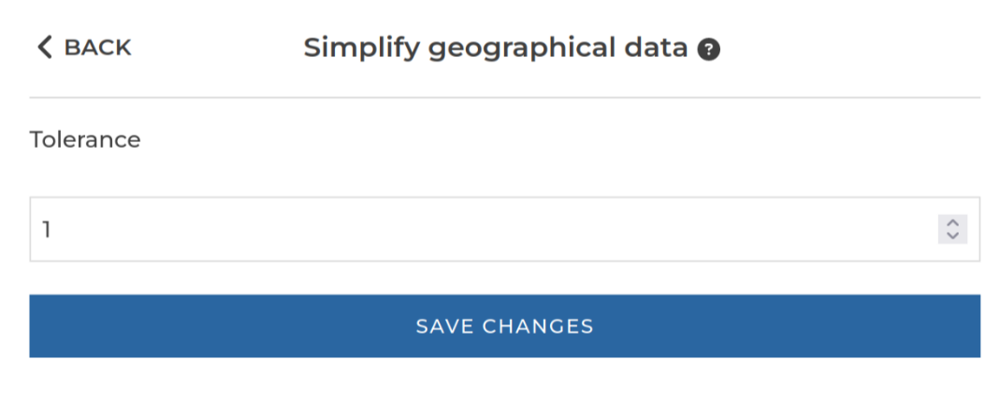

### Geographical simplification

This step reduces the size of your data by making it less precise. The higher you set the tolerance, the smaller (and the less
precise) your data will be. See the [technical documentation](/docs/steps/) for details.

**This step is supported by the following backends:**

- Pandas (python)

#### Where to find this step?

- `Geo` widget
- Search bar

#### Options reference

- `Tolerance`: The tolerance to use when simplifying your data.
