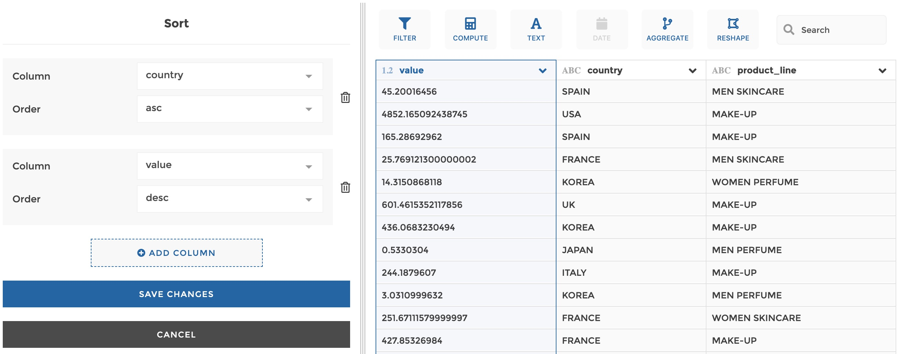

### Sort values

You can use this step to sort values based on one or several columns.

**This step is supported by the following backends:**

- Mongo 4.0
- Mongo 3.6

#### Where to find this step?

- Column header menu
- Search bar

#### Options reference

- `Column...`: the column where values will be sorted

- `Order`: whether you want the values in this column to be sorted in ascending
  (`asc`) or descending order (`desc`).

You can add columns to apply a combined sort, by clicking on "Add column". The
order of columns matters, i.e. first the first column will be sorted, then and
without changing the order of the first column, the second column will be
sorted etc. Please see the example below for illustration.

You can specify if you want to rank rows based on one or several columns.

#### Example

This configuration results in:

First the column country is sorted by ascending order, and then values are
sorted by descending order.
