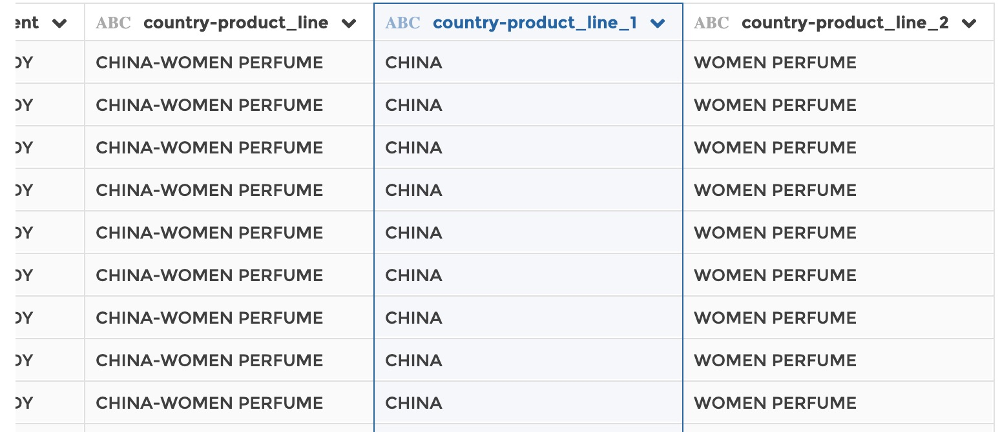

### Split column

You can use this step to split a text column into several columns, based on a
delimiter.

**This step is supported by the following backends:**

- Mongo 4.0
- Mongo 3.6
- Pandas

#### Where to find this step?

- Widget `Text`
- Search bar

#### Options reference

- `Split column`: the column to be splitted

- `Delimiter`: a character or a string of characters that will be identified as
  delimiter to split the column

- `Number of columns to keep`: the number of columns to keep after spklitting
  the original column

The original column remains intact while the split results are written in
specific columns automatically named after the original column name (in the
form `original_column_name_1`, `original_column_name_2` etc.).

#### Example

This configuration results in:

