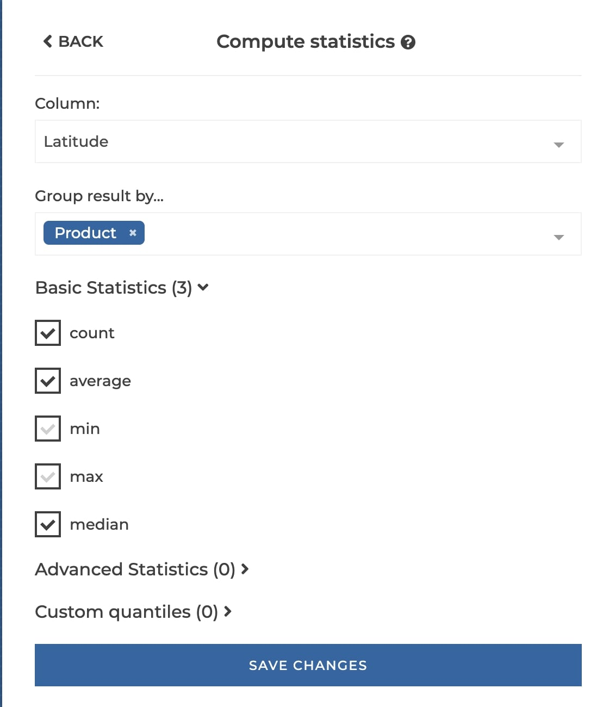
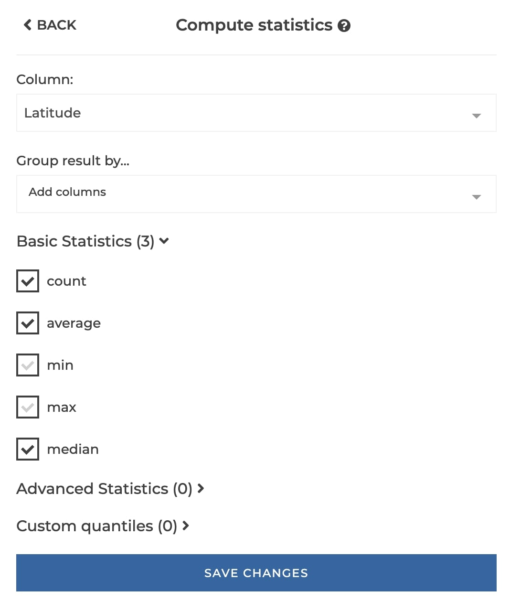
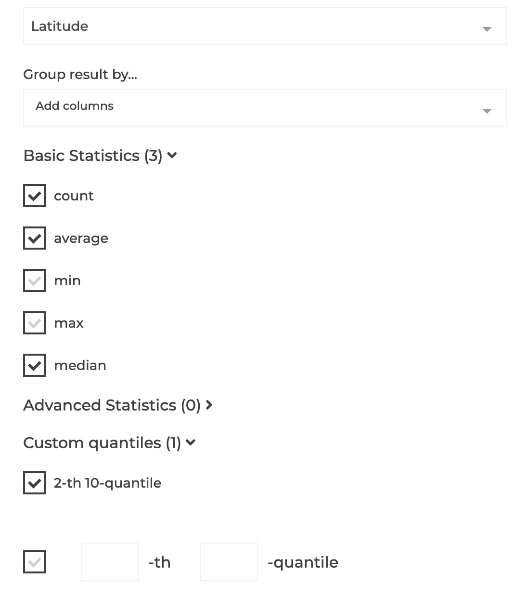

### Column's Statistics

You can use this step to compute main statistics, like median or quintiles, of a numeric column.

**This step is supported by the following backends:**

- Mongo 4.2
- Mongo 4.0
- Mongo 3.6

#### Where to find this step?

- Column header menu
- Widget `Compute`
- Search bar

#### Options reference

- Choose the column to compute the statistics. This column must be of type 'float' or 'integer'.

- Optionally, you can split the result by other columns values.

- Check statistics to compute.

- You can also in the "custom quantile" section define quantiles. For instance, the median is the 1st 2-quantile.

#### Examples

#### Basic example

This configuration results in:

#### With a group column

This configuration results in:

#### Defining a custom quantile

This configuration results in:

