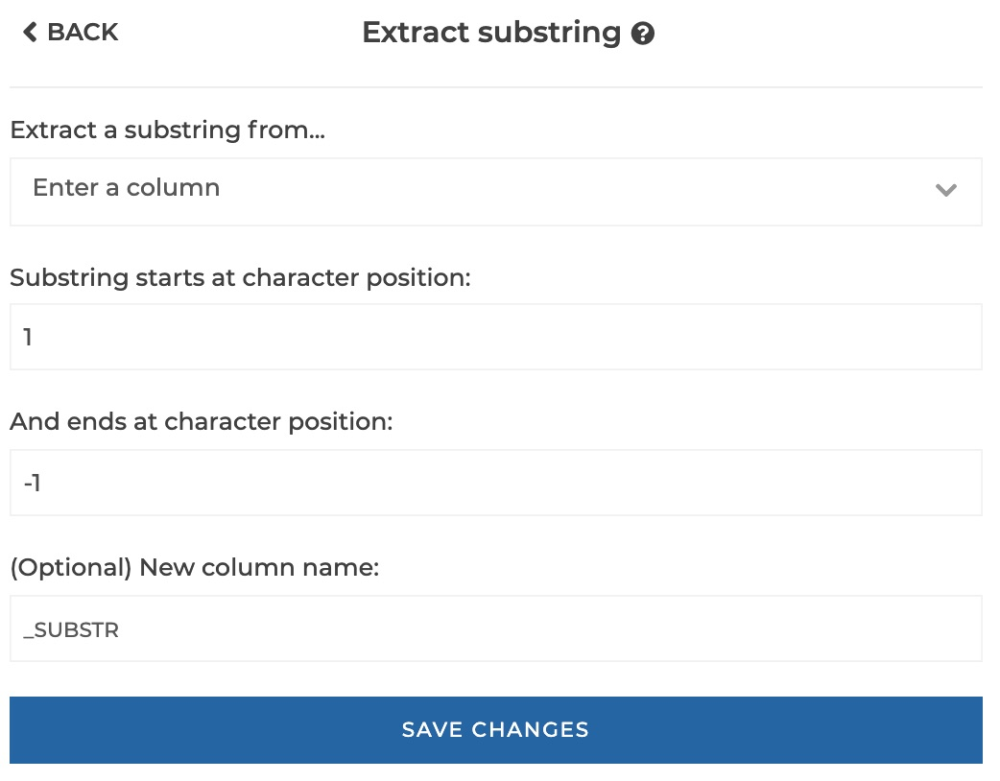
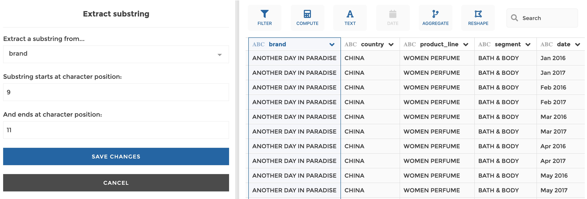
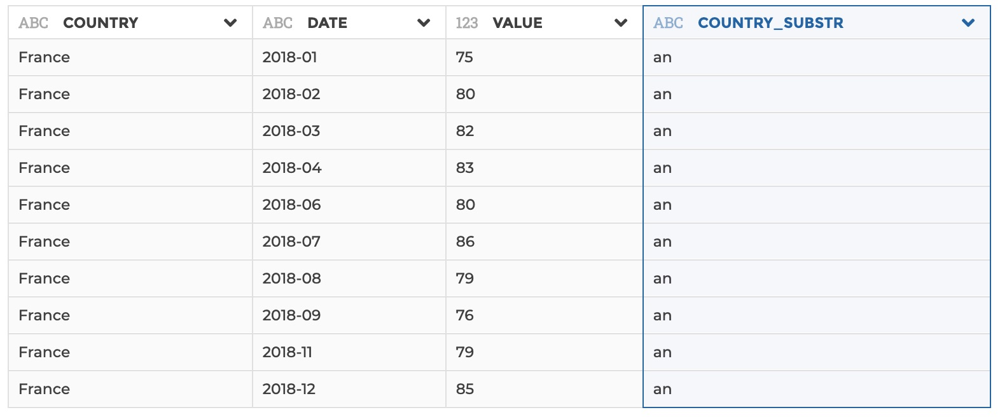
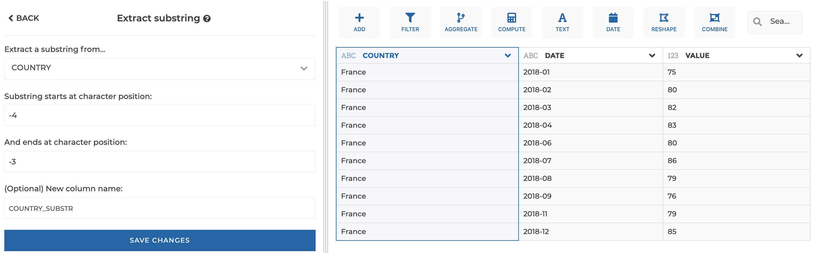

### Extract substring

You can use this step to exctract a sustring of characters in a text column.

**This step is supported by the following backends:**

- Mongo 4.0
- Mongo 3.6

#### Where to find this step?

- Widget `Text`
- Search bar

#### Options reference

- `Extract a substring from...`: the text column you need to extract a substring
  from
- `Substring starts at character position`: the position of the first character
  of the sustring you want to extract.
- `Substring ends at character position`: the position of the last character
  of the sustring you want to extract.
- `New colum name:` (optional): if you want to give a custom name to the column
  of results to be created. By default, it will be your original column name
  suffixed by '\_SUBSTR'.

The character positions are integers that can be either positive (starting at 1
for the first character of the original string) or negative (starting at -1 for
the last character of the original string). The can never be equal to 0.

The character position of the last character of the substring should always
refer to a character position higher than the first character of the substring.
If not, you will get a backend error.

> Hint: use negative character positions when you need to count characters from
> the end of the original string.

#### Example 1: positive character positions

This configuration results in:

#### Example 2: negative character positions

This configuration results in:

