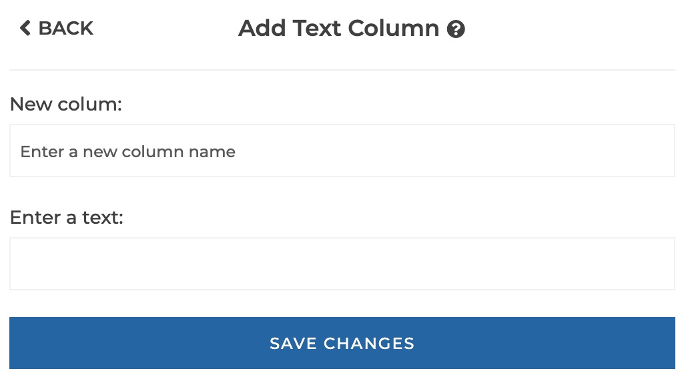
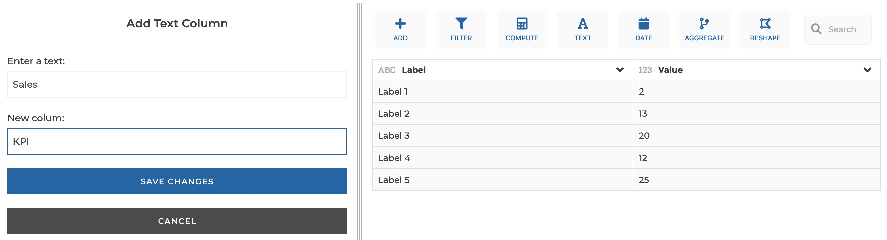

### Add text column

Use this step to add a text column where every value will be equal to the
specified text.

#### Where to find this step?

- Widget `Add` and `Text`
- Search bar

#### Options reference

- `Text`: the text that you want to write in the new column

- `New column`: the name of the new column to be created

#### Example:

This configuration results in:

