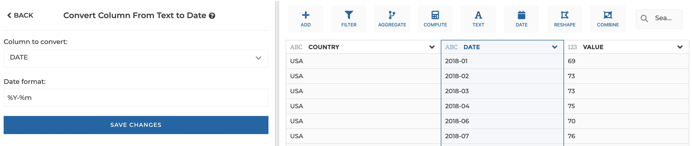

### Convert text column to date

You can use this step to cast a text column to date.

**This step is supported by the following backends:**

- Mongo 4.0
- Mongo 3.6

#### Where to find this step?

- Widget `Date`
- Search bar

#### Options reference

- `Column to convert:`: the text column to be converted to date

- `Date format:`: (optional). By default, the backend tries to guess the date
  format of your column. But if needed you can specify here a custom format.

Please see the [Mongo documentation](https://docs.mongodb.com/manual/reference/operator/aggregation/dateFromString/index.html#datefromstring-format-specifiers)
for Mongo supported formats.

#### Example

This configuration results in:

