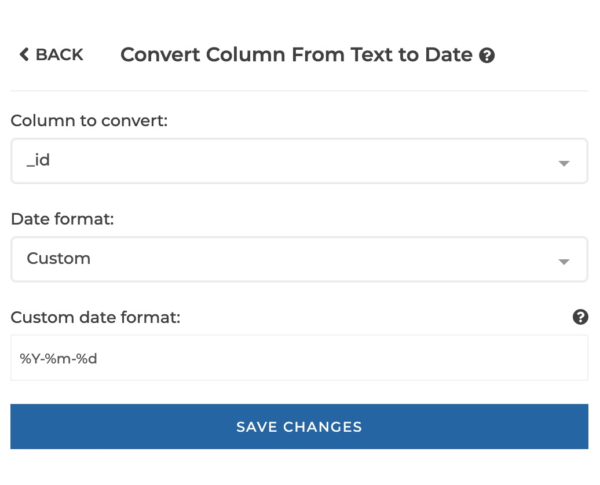

### Convert text column to date

You can use this step to cast a text column to date.

**This step is supported by the following backends:**

- Mongo 4.0
- Mongo 3.6

#### Where to find this step?

- Widget `Date`
- Search bar
- Column header data type icon

#### Options reference

 

 

 

- `Column to convert:`: the text column to be converted to date

- `format:`: either 'Try to guess' (the backend tries to infer the date format of your column),
  'Custom' (to allow you to enter a custom format in the `custom format` parameter below),
  or a preset (e.g. "%d-%m-%Y"). Please see the [Mongo documentation](https://docs.mongodb.com/manual/reference/operator/aggregation/dateFromString/index.html#datefromstring-format-specifiers)
  for Mongo custom supported formats.

#### Example

This configuration results in:

