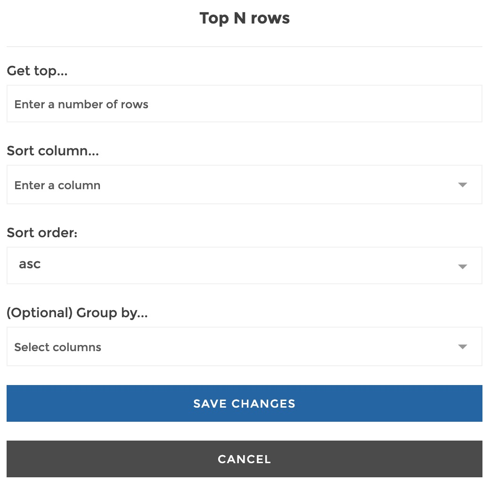
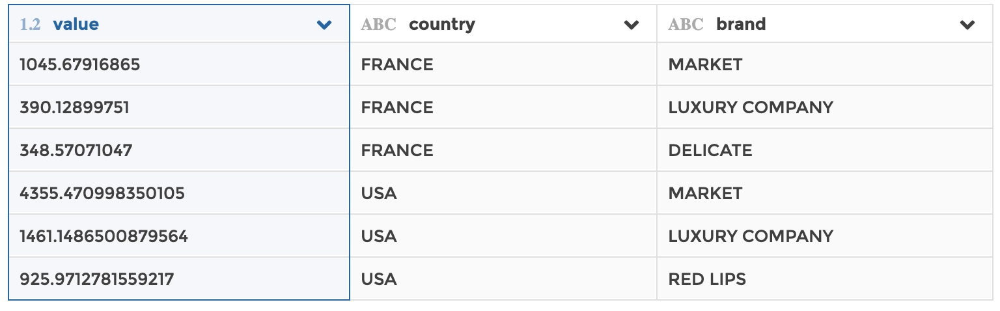

### Top N rows

Use this step if you need to get the top N rows of your data based on value
column to be ranked. The top can be performed by group if specified (i.e. if you
want a top 3 by group, it will return the top 3 rows for every group - see the
example below for illustration).

Similar to a `SELECT TOP` clause in SQL.

**This step is supported by the following backends:**

- Mongo 4.0
- Mongo 3.6

#### Where to find this step?

- Widget `Filter`
- Search bar

#### Options reference

- `Get top...`: specify the numer of top rows to retain

- `Sort column...`: the ranking will be based on this column (so its values must
  be sortable)

- `Sort order...`: wether the you want the above column to e sorted on ascending
  (`asc`) or descending (`desc`) order

- `Group by...` (optional): if you want to return a top by group, you can
  select one or several columns that will be used to constitute unique groups
  (equivalent to the columns that you would specify after the `GROUP BY` clause
  in SQL or in the `_id` field of a `$group` in Mongo aggregation pipeline)

#### Example

This configuration results in:

We get the top 3 brands by country.
