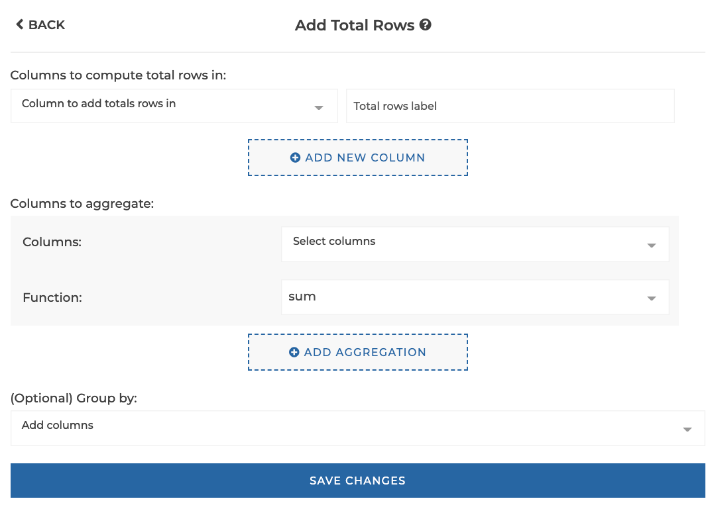
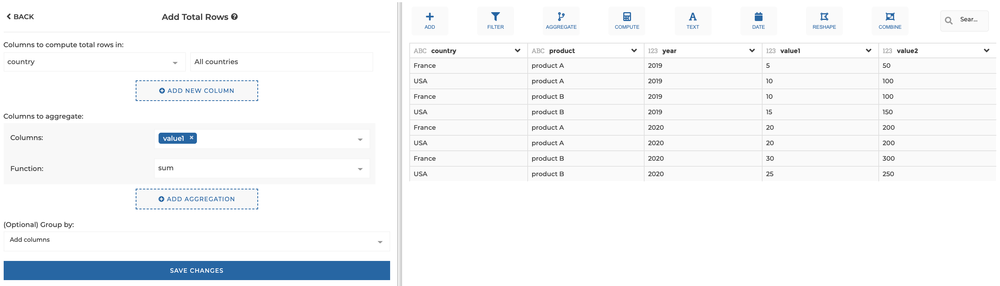
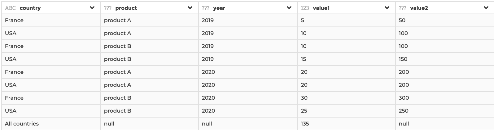
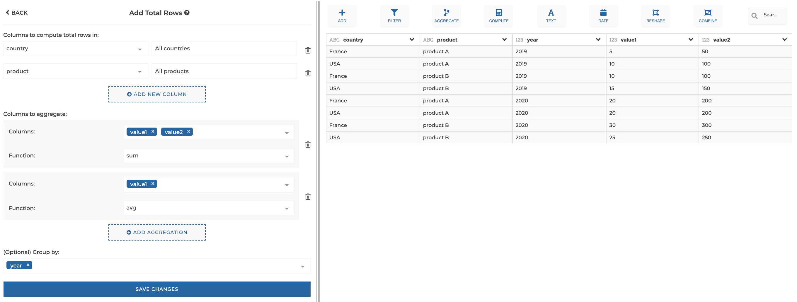
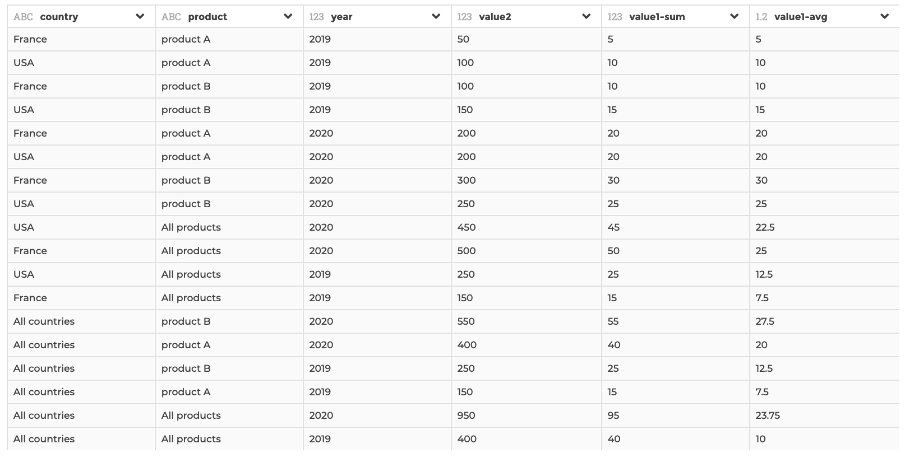

### Add Total Rows

Use this step if you need to compute "Total" columns and append those rows to
your current dataset (see examples below for more details).

**This step is supported by the following backends:**

- Mongo 4.0
- Mongo 3.6
- Pandas

#### Where to find this step?

- Widget `Aggregate`
- Search bar

#### Options reference

- `Columns to compute total rows in`: Specify a dimension columns on the left
  side, and the corresponding total rows label on the right side (for example if
  you have a a dataset with sales by country and that you want to compute the
  total sales of all countries, you will specify your country column and give a
  label such as "Total countries"). You can add several couples to compute total
  rows in several columns.

- `Columns to aggregate`: in this section of the form you can specify one or more
  columns to aggregate, with the corresponding aggregation function to be
  applied (equivalent to `SUM(MY_COLUMN)` for example in SQL, or to
  `my_column: { $sum: { $my_column } }` in Mongo). You can add columns to
  aggregate by clicking on the button `Add aggregation`.

  - `Columns`: the columns to be aggregated (you can apply the same aggregation
    function to several columns at once)

  - `Function` the aggregation function to be applied (sum, average, count, min
    or max)

- `(Optional) Group by`: Optional, if you need to apply the total rows
  computation by group of rows (see the second example below for illustration)

#### Example 1: Basic usage

This configuration results in:

#### Example 2: More advanced usage

This configuration results in:

