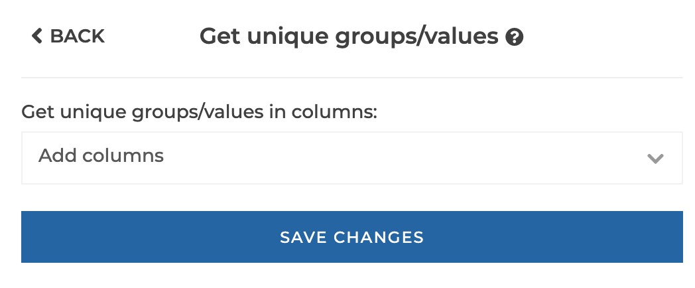
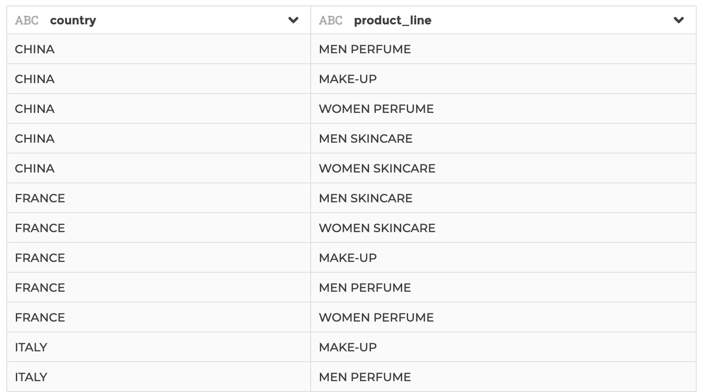

### Get unique groups/values

You can use this step to get the values from a column or unique groups of values
from a combination of several columns.

**This step is supported by the following backends:**

- Mongo 4.0
- Mongo 3.6

#### Where to find this step?

- Column header menu
- Widget `Aggregate`
- Search bar

#### Options reference

- `Get unique groups/values in columns`: you can select one or several columns
  that will be combined to constitute unique groups of values

#### Example

This configuration results in:

