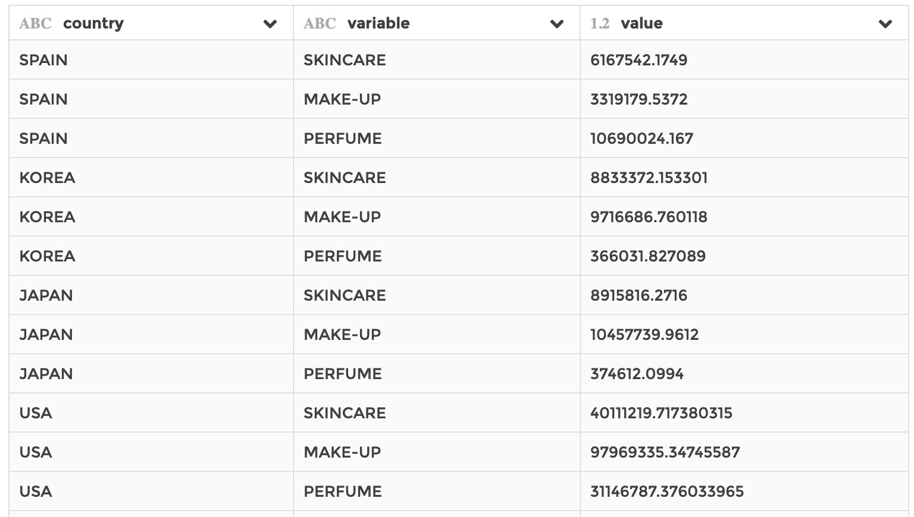

### Unpivot column

You can use this step if you need to transform columns into rows. It is the
reverse operation of a `pivot` step.

Unpivoting columns into a unique column means that every unpivoted column header
will be used as a label in the output unique column. The columns get unpivoted
"around" fixed columns that you can specify. The step creates two new columns:
a `variable` column where you can find the labels corresponding to the unpivoted
columns headers, and a `value` column where you can find the value for every
label.

Equivalent to the `UNPIVOT` clause in SQL.

**This step is supported by the following backends:**

- Mongo 5.0
- Mongo 4.2
- Mongo 4.0
- Mongo 3.6

#### Where to find this step?

- Widget `Reshape`
- Search bar

#### Options reference

- `Keep columns...`: the columns to remain fixed, around which the unpivot will
  occur

- `Unpivot columns...`: the columns to be unpivoted

- `Drop null values...`: whether to drop rows if their value is null in the
  output `value` column

#### Example

This configuration results in:

