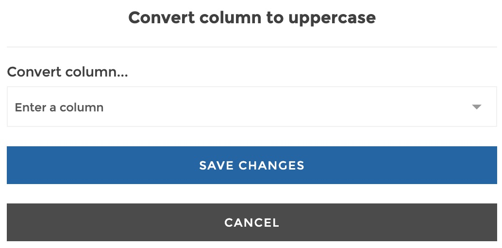
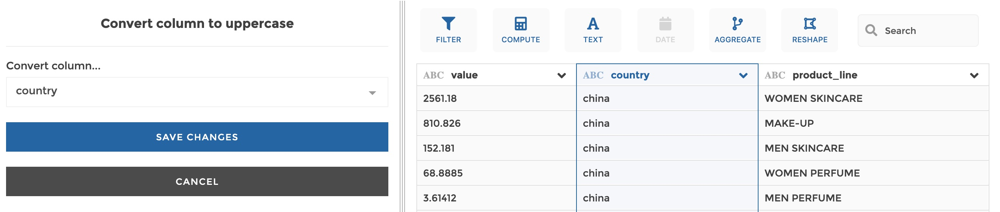
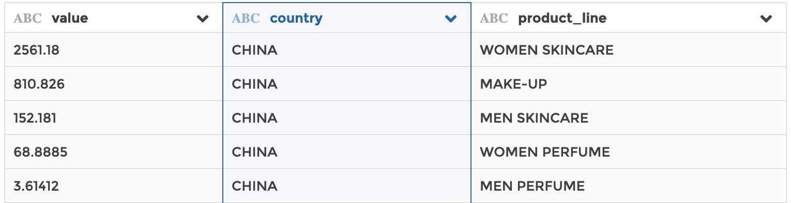

### To uppercase

You can use this step to convert a text column to uppercase.

**This step is supported by the following backends:**

- Mongo 5.0
- Mongo 4.2
- Mongo 4.0
- Mongo 3.6

#### Where to find this step?

- Widget `Text`
- Search bar

#### Options reference

- `Convert column...`: the column to be converted into uppercase

#### Example

This configuration results in:

