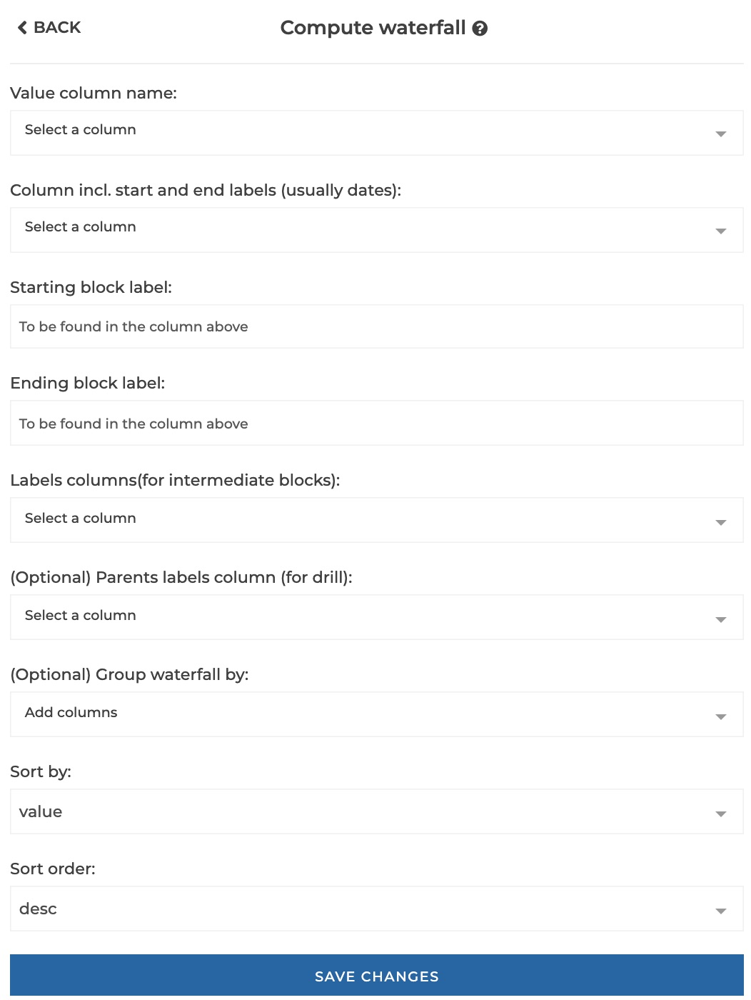
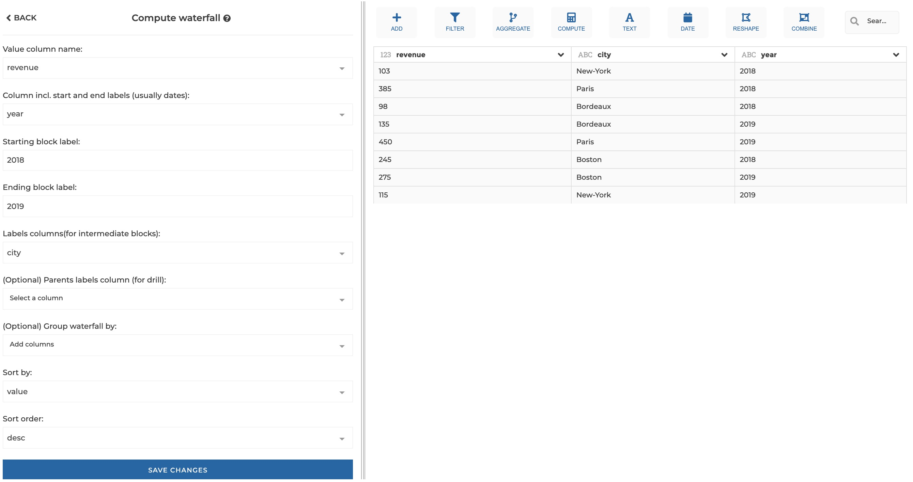

### Waterfall

This step allows to generate a data structure useful to build waterfall charts.
It breaks down the variation between two values (usually between two dates)
accross entities. Entities are found in the `labelsColumn`, and can optionally
be regrouped under common parents found in the `parentsColumn` for drill-down
purposes.

**This step is supported by the following backends:**

- Mongo 4.0
- Mongo 3.6
- Pandas (python)

#### Where to find this step?

- Widget `Reshape`
- Search bar

#### Options reference

- `Value column name`: the name of the value column tht will be used to compute
  waterfall blocks values

- `Column incl. start and end labels (usually dates)`: name of the column that
  includes the labels of the starting and ending blocks of the waterfall
  (usually dates)

- `Starting block label`: the label of the starting block to find in the column
  above

- `Ending block label`: the label of the ending block to find in the column
  above

- `Labels columns (for intermediate blocks)`: the name of the column where
  intermediate blocks labels are to be found (used to break down the total
  variation between the starting and ending block)

- `(Optional) Parents labels column (for drill-down)`: the name of the column
  where parent labels are to be found if any, for drill-down purposes (parents
  of the labels specified above)

- `(Optional) Group waterfall by`: the columns used to group waterfall
  computation (useful to keep track of a column used for filtering for example)

- `Sort by`: whether to sort waterfall blocks depending on their labels or on
  their values

- `Sort order`: whether to use ascending or descending order when sorting

#### Example 1 : Basic configuration

This configuration results in:

#### Example 2 : Configuration with optional parameters

This configuration results in:

