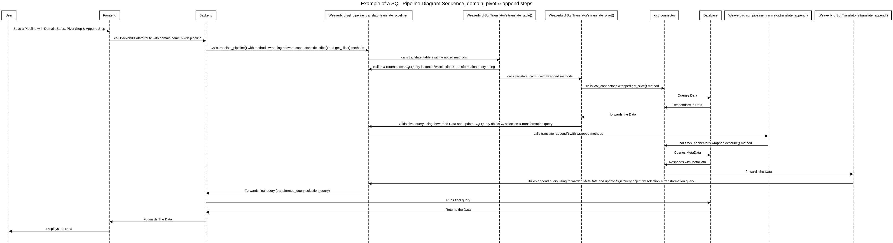

# SQL Translator's Sequence diagram

Below we describe the calls chain of an SQL pipeline with 3 steps: 
* domain step
* pivot step
* append step

These example pipeline help us to illustrates the interactions between Frontend, Backend, Weaverbird & Toucan Connectors

